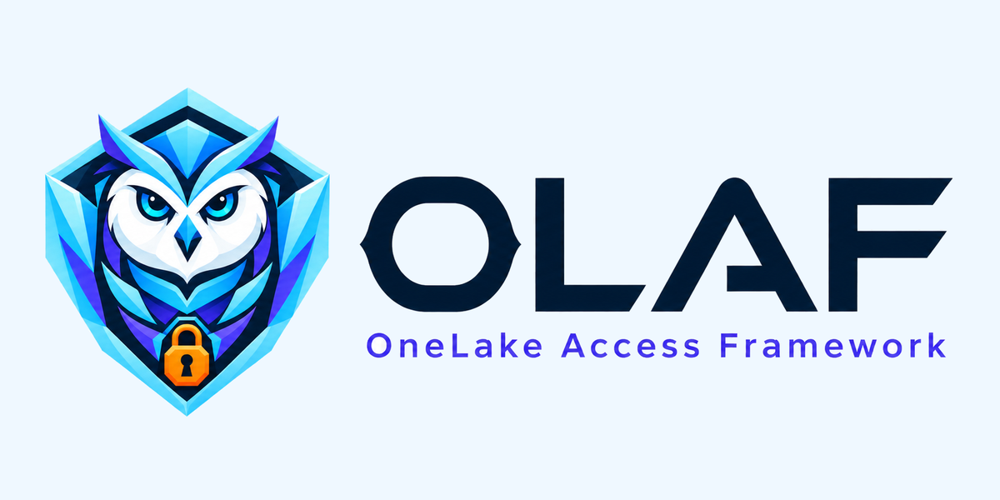

<p align="center">
  <picture>
    <source media="(prefers-color-scheme: dark)" srcset="assets/brand/olaf-lockup-dark.png">
    
  </picture>
</p>

<p align="center">
  Review every access change. Apply only what you approved.
</p>

<p align="center">
  <a href="https://github.com/kengio/olaf/actions/workflows/test.yml"></a>
  <a href="LICENSE"></a>
  
</p>

> [!IMPORTANT]
> **OLAF v1.0.0 is an independent community Preview for evaluation and
> development, not a production-ready security product.** Its mutating path
> depends on Microsoft's bulk Data Access Roles `PUT`, which is officially
> documented as **Preview** and not recommended for production use.
> [Official endpoint status](https://learn.microsoft.com/en-us/rest/api/fabric/core/onelake-data-access-security/create-or-update-data-access-roles)

> [!CAUTION]
> OLAF stores principal identifiers and authorization/recovery state in control
> tables and under `Files/security`. Sensitive modes are disabled by default and
> require a clean DAR snapshot with an ETag. The per-run workspace isolation
> attestation is optional — OLAF records it as `attested` or `unknown` and
> never gates on it. Complete the external access review **before uploading a
> real workbook**. Start with [Protecting OLAF control data](docs/control-data-security.md).

**OLAF — OneLake Access Framework** is a plan → review → apply workflow for
Microsoft Fabric OneLake data access roles. It is one self-contained Fabric
notebook with an Excel-authored configuration, a generated mapping, a saved plan,
and an audit trail.

OLAF is not affiliated with, endorsed by, sponsored by, or supported by Microsoft.
The product names above are used only to describe interoperability. See
[Microsoft's Trademark and Brand Guidelines](https://www.microsoft.com/en-us/legal/intellectualproperty/trademarks)
and the project's [platform contract](docs/platform-contract.md).

## What OLAF does

| Need | OLAF behavior |
|---|---|
| Review intended access | `generate` resolves authored scopes and members; `plan` presents the desired-versus-live diff. |
| Refuse stale approval | `apply` requires a saved plan for the same config and mapping generation and rechecks observable drift. |
| Fail closed around sensitive control data | Every sensitive write requires the DAR snapshot gate and an operation sentinel; the per-run operator attestation is optional and only recorded, as `attested` or `unknown`. |
| Preserve recovery evidence | Destructive paths record prepared intent and recovery pointers before a real DAR write. |
| Explain current state | Read-only audit methods expose lineage, drift, coverage, and engine-explicit policy calculations. |

OLAF validates configuration and request construction. Microsoft Fabric remains the
enforcement system, and enforcement depends on the engine, access mode, workspace
role, item permissions, and shortcuts. See the official
[engine and user access model](https://learn.microsoft.com/en-us/fabric/onelake/security/data-access-control-model#engine-and-user-access-to-data)
and [SQL endpoint enforcement guidance](https://learn.microsoft.com/en-us/fabric/onelake/security/troubleshoot-onelake-security-for-sql-analytics-endpoints#access-modes-and-enforcement).

## Before you start

- Use Microsoft Fabric Runtime 1.3 / Spark 3.5 or newer, then verify the selected
  runtime and bundled package versions in your Fabric environment. Microsoft
  publishes the [runtime lifecycle](https://learn.microsoft.com/en-us/fabric/data-engineering/lifecycle)
  and [OneLake security limitations](https://learn.microsoft.com/en-us/fabric/onelake/security/data-access-control-model#onelake-security-limitations).
- Use a workspace Admin or Member identity for DAR edits and ensure the REST caller
  has `OneLake.ReadWrite.All`. Contributor does not edit DAR definitions. See
  [workspace permissions](https://learn.microsoft.com/en-us/fabric/onelake/security/data-access-control-model#onelake-security-and-workspace-permissions)
  and the [bulk DAR authorization contract](https://learn.microsoft.com/en-us/rest/api/fabric/core/onelake-data-access-security/create-or-update-data-access-roles).
- Treat the same-lakehouse layout as a trusted-administrator boundary, not
  cryptographic or transactional isolation. If that threat model is unacceptable,
  do not import real principal data or run sensitive modes in v1.0.0.

## Quick start

OLAF runs inside a Fabric notebook; it is not a CLI.

1. Import [`notebooks/olaf.ipynb`](notebooks/olaf.ipynb) and optionally the
   [`olaf_master_workflow.ipynb`](notebooks/olaf_master_workflow.ipynb) driver.
   See [Getting the notebooks into Fabric](docs/fabric-import.md).
2. Attach the intended lakehouse and run the read-only health diagnostic before
   setup:

   ```python
   OLAF.configure(lakehouse_name="SampleLakehouse")
   OLAF.health()
   ```

3. Review and remove reserved-path DAR overlap, broad `ReadAll` access, dynamic
   default-reader access, unauthorized elevated workspace roles, shares, shortcuts,
   and automation that can reopen them. Record the review in your change system.
   Microsoft documents these access paths in the
   [OneLake access model](https://learn.microsoft.com/en-us/fabric/onelake/security/data-access-control-model).
4. Supply the review reference for this run, then create the control tables:

   ```python
   OLAF.configure(
       lakehouse_name="SampleLakehouse",
       control_data_isolation_attestation="change-review-123",
   )
   OLAF.setup()
   ```

5. Only now upload a sanitized copy of
   [`configs/onelake_security.xlsx`](configs/onelake_security.xlsx) under
   `Files/security`, replace every synthetic row, verify every Entra object ID, and
   import both sheets:

   ```python
   OLAF.load_config("member", "Files/security/onelake_security.xlsx", "member")
   OLAF.load_config("config", "Files/security/onelake_security.xlsx", "config")
   ```

6. Use a new attestation reference for each sensitive operation and review every
   result:

   ```python
   OLAF.generate()
   OLAF.plan()
   OLAF.apply()
   ```

Do not treat a successful request or dry run as proof of propagation or enforcement.
The release has fixture-based CI evidence only; it does not claim live verification
for the release SHA. See [Evidence status](docs/platform-contract.md#evidence-status).

## Modes at a glance

| Mode | Purpose | Writes |
|---|---|---|
| `setup` | Create or migrate the four control tables after the privacy gate. | tables and audit |
| `validate` | Run configuration validation without a mapping, log, file, backup, or DAR write. | none |
| `generate` | Resolve config and member data into a versioned mapping and review artifact. | sensitive artifacts and audit |
| `plan` | Compare desired and live DAR state and save the reviewed plan. | sensitive audit |
| `apply` | Submit the reviewed payload through the Preview bulk DAR endpoint. | backup, audit, and DAR |
| `rollback` | Restore a selected config version, then run the guarded deployment chain. | config, artifacts, audit, and DAR |
| `show` | Read-only live pivot. | none |
| `trace` | Read-only operational and drift summary. | none |

`reset()` and `cleanup()` are interactive destructive utilities. Reset is subject to
the full sensitive-write gate. Cleanup is an emergency containment path that may run
without attestation, preserves an incident sentinel, and cannot prove that prior
disclosure was erased. See the [mode manual](docs/modes.md) and
[runbook](docs/runbook.md).

Every mode returns one result envelope:

```text
mode · status · changed · message · params · data · error
batch_id · run_id · config_hash
```

`changed` may be `null` when a real write outcome is ambiguous. A confirmed or
ambiguous write is never reported as `changed=false`. See
[Error handling](docs/error-handling.md).

## Configuration model

The workbook has two authored sheets:

- `config`: roles, table/folder scopes, permission, RLS/CLS, and member names;
- `member`: the synthetic-name-to-Entra-object-ID preload used by OLAF.

The workbook is an untrusted input. Verify every object ID against Entra before
loading. OLAF deliberately does not call Microsoft Graph for directory resolution;
that is a project design choice, not a claim that Graph tokens are universally
impossible in Fabric notebooks. NotebookUtils documents an evolving audience list:
[Get a token](https://learn.microsoft.com/en-us/fabric/data-engineering/notebookutils/notebookutils-credentials#get-token).

The generated mapping carries explicit scopes and provenance. It is a review artifact,
not an authorization boundary by itself. Full references:

- [Config examples](docs/config-examples.md)
- [Data model](docs/data-model.md)
- [Rule catalog](docs/architecture.md#rule-catalog)
- [Workbook instructions](configs/README.md)

OLAF's predicate parser is intentionally conservative and is not an exhaustive
statement of what the platform accepts. Use Microsoft's current
[RLS syntax reference](https://learn.microsoft.com/en-us/fabric/onelake/security/row-level-security-syntax).
Role, member, path, and latency values are volatile platform limits; consult the
[current limitations](https://learn.microsoft.com/en-us/fabric/onelake/security/data-access-control-model#onelake-security-limitations)
and [latencies](https://learn.microsoft.com/en-us/fabric/onelake/security/data-access-control-model#latencies-in-onelake-security)
pages at deployment time.

## Concurrency and recovery

OLAF requires an ETag-bearing DAR snapshot for sensitive writes. Conditional DAR
requests use the exact captured ETag; a missing or changed snapshot blocks instead
of silently refreshing the approved state. Microsoft documents the collection ETag,
optional `If-Match`, and `412` response in the official
[list](https://learn.microsoft.com/en-us/rest/api/fabric/core/onelake-data-access-security/list-data-access-roles)
and [bulk PUT](https://learn.microsoft.com/en-us/rest/api/fabric/core/onelake-data-access-security/create-or-update-data-access-roles)
references.

That ETag covers only the DAR collection. It does not lock workspace sharing,
privileged access, shortcuts, or local Delta/file writes. A REST response, control
table change, audit append, backup write, and Delta `RESTORE` are not one transaction.
Preserve the incident sentinel, prepared record, and recovery pointers after a
partial or ambiguous operation. Follow
[Protecting OLAF control data](docs/control-data-security.md) and the
[recovery runbook](docs/runbook.md#3c-recovery--break-glass-incident-procedure-no-public-replay-api).

## Documentation

- [Documentation map](docs/README.md)
- [Platform contract](docs/platform-contract.md)
- [Control-data security](docs/control-data-security.md)
- [Runbook](docs/runbook.md)
- [Mode manual](docs/modes.md)
- [API reference](docs/api-reference.md)
- [Testing guide](docs/testing.md)
- [Roadmap](docs/roadmap.md)

## Repository layout

```text
notebooks/   runtime and optional workflow/example notebooks
configs/     synthetic starter workbook
tests/       fixture-based pytest suite
scripts/     repository checks
docs/        operator and API documentation
assets/      OLAF-owned artwork
```

## Security and support

Read [SECURITY.md](SECURITY.md) before using real principal data. GitHub private
vulnerability reporting is the confidential route when maintainers have enabled it;
the release gate verifies that setting before publication. GitHub documents the
[reporting flow and configuration requirement](https://docs.github.com/en/code-security/how-tos/report-and-fix-vulnerabilities/report-privately).

General questions and sanitized bug reports belong in
[GitHub issues](https://github.com/kengio/olaf/issues). See [SUPPORT.md](SUPPORT.md)
and [CONTRIBUTING.md](CONTRIBUTING.md).

## License and identity

Code, documentation, and project artwork are licensed under [MIT](LICENSE), with
`OLAF contributors` as the collective notice. Brand guidance is a request, not an
additional license restriction: [OLAF brand guidelines](docs/brand-guidelines.md).

---

<sub><b>Independent-project disclaimer.</b> OLAF is an independent community
project and is not affiliated with, endorsed by, sponsored by, or supported by
Microsoft. Microsoft, Microsoft Fabric, and OneLake are trademarks of the Microsoft
group of companies. No Microsoft logo or product icon is used by this project.</sub>
