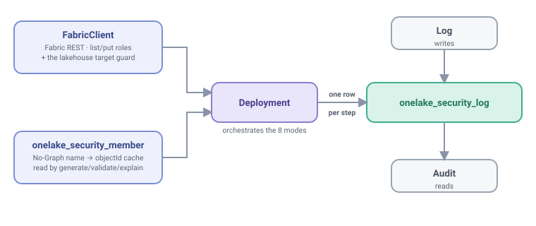

# API reference

> **Community Preview:** OLAF is an independent project, not affiliated with or endorsed by
> Microsoft. Mutating methods depend on a
> [Preview bulk DAR endpoint](https://learn.microsoft.com/en-us/rest/api/fabric/core/onelake-data-access-security/create-or-update-data-access-roles)
> intended for evaluation/development, not production use. Sensitive methods, including first
> setup, are disabled by default until the [control-data contract](control-data-security.md) is
> satisfied.

An index into `notebooks/olaf.ipynb` -- the single self-contained runtime that holds
every class and function in the framework. Most users drive the framework through **`OLAF`**, the
interactive facade documented below -- read the rest of this page (the lower-level domain classes)
only when you want to call `Deployment`/`Audit`/`FabricClient`/`Log` directly (a notebook cell, a
test, a custom pipeline step).

## `OLAF` -- the primary interactive interface

`OLAF` is a singleton-static, flat facade -- never instantiate it; call every method
at first level:

```
OLAF.setup() · .health() · .status() · .diagnose_member(member)
OLAF.explain() · .generate(rebuild=False) · .validate() · .plan() · .apply(keep_unmanaged=False)
              · .rollback(rollback_to_version="", rollback_reason="")
OLAF.show(by, subject="") · .trace()
OLAF.reset() 🔥 · .cleanup() 🔥                  # destructive, interactive-only
          + read passthroughs: runs / log_history / batch / failures / last_run /
            current_generation / is_stale / verify_chain / grants / provenance / out_of_band /
            effective_access / who_can_access / coverage / drift / timeline / authored_by /
            config_at / table_history / at / config_diff / value_history / report
OLAF.configure(env=..., config_table=..., ...)   # base params shared by every method
                                                # (keep_unmanaged / rebuild are per-call, not configurable)
```

Full detail (every signature, exact return columns, and a worked example per method) lives on its
own page: **[`api/OLAF.md`](api/OLAF.md)**. This section is the OLAF-first overview: how to reach it,
the two invariants that set it apart from the pipeline path, and a quick reference.

### The three entry paths

| Path | How you call it | Outcome handling |
|---|---|---|
| **Pipeline** | A Fabric pipeline / `notebook.run` sets the `mode` parameter on `olaf.ipynb`; the guarded ▶️ Run cell calls `run_and_exit(mode, allowed, params, spark)`. | **Raises** on `blocked`/`error` (the native Fabric Failure arrow, so a pipeline branches on it); `notebook.exit(...)` with the full envelope JSON on `success`/`skipped`. |
| **Interactive** | Inside `olaf.ipynb` itself, with `mode` left at its `""` default (see the guard below), call `OLAF.<action>()` in any cell. | **Never raises** on outcome -- every method returns a Spark DataFrame; a blocked/error outcome comes back as a DataFrame whose `status` column says so, with the raw envelope at `OLAF.last_result`. |
| **Cookbook / driver notebook** | A separate notebook runs `%run olaf` -- Fabric's `import` -- to load the OLAF facade + every class into its own namespace, then calls `OLAF.<action>()`. Same mechanics as interactive; see [`notebooks/olaf_cookbook.ipynb`](../notebooks/olaf_cookbook.ipynb) for one worked cell per method. | Same as interactive: never raises. |

**The `mode=""` dispatch guard:** the parameters cell defaults `mode = ""`, and the Run cell only
dispatches `if mode:`. So `%run olaf` with no `mode` set loads the notebook as a pure
library -- every class and `OLAF` are defined, but *nothing runs*, and critically `notebook.exit` is
never called (which would otherwise terminate the parent notebook that `%run`-ed this one). A
pipeline sets `mode` to a real value to dispatch for real; the interactive/cookbook paths never
need to.

### Two invariants

- **Never raises on outcome.** the `OLAF` ops methods and `OLAF.show()`/
  `.trace()` route through `run_mode` (the non-raising engine); a blocked/error outcome becomes a
  DataFrame, not an exception. The four live-DAR audit reads (`out_of_band`, `effective_access`,
  `who_can_access`, `drift`) are the one exception -- they raise **`UsageError`** (part of the
  `OLAFError` hierarchy -- **not** a bare `RuntimeError`) when no `FabricClient` resolved, exactly as
  calling the underlying client-less `Audit` method would. `OLAF.configure()` raises the same
  `UsageError` for the per-call `keep_unmanaged`/`rebuild` keys, and for an `env` that fails its
  `^[A-Za-z0-9_-]{1,64}$` validation -- a *call* guard, not an outcome: it fires before any mode
  runs. `OLAF.reset()` also raises `UsageError` off-Fabric, before it submits anything -- it needs a
  live client and is not routed through `run_mode` (there is no `mode="reset"`).
- **Uniform return.** Every method returns **one** DataFrame type -- an all-string Spark DataFrame
  (booleans render as the literal text `"True"`/`"False"`), the same shape `Audit._df` builds, so
  it works under the CI fake-spark harness and displays natively on Fabric. A query/audit method
  returns its result table; an ops method (`generate`/`plan`/`apply`/`setup`/`rollback`) returns a
  compact DataFrame *view* of the outcome envelope (the raw dict stays at `OLAF.last_result`).
  **Exception:** `config_at`/`at` are Delta time-travel reads and return the control table's own
  **native schema** (real types, e.g. a BOOLEAN `active`), not the all-string projection -- a
  point-in-time snapshot deliberately shows the table's true types.

### `OLAF.configure(**kw)`

Sets base params (`env`, `tenant_id`, `config_table`, `mapping_table`, `log_table`, ...) shared by
every method, so you don't repeat them on every call. Chainable.

**`keep_unmanaged` and `rebuild` are refused** (`UsageError` naming the key): they are **per-call**
parameters on the live-data-mutating paths, so they are passed to `OLAF.apply(...)` /
`OLAF.generate(...)` on the call that needs them, never configured once and inherited.

**`env` is validated**, not free-form: a value that is given must match `^[A-Za-z0-9_-]{1,64}$`
(1-64 chars of letters/digits/`_`/`-`). An invalid value raises `UsageError` before anything is
stored -- the same rule `run_mode` enforces on the pipeline path -- because `env` is stamped on
every audit row and read back as a SQL `WHERE` literal by the log reads. `env` is **optional** and defaults to blank: it exists to tell one environment's log rows from another's when several deployments share a control-table shape, so a deployment that needs no such split leaves it unset. A blank env is stored as **NULL** (like every other blank string column), and the log reads scope on `env IS NULL` accordingly — an ad-hoc query for unlabelled rows must do the same, `env = ''` matches nothing.

```python
%run olaf
OLAF.configure(env="qa", tenant_id="00000000-0000-0000-0000-000000000000")
OLAF.configure(rebuild=True)              # UsageError -- per-call only
OLAF.generate(rebuild=True)    # this is where it belongs
```

Returns a DataFrame of every parameter the next run will use — the values you set over the defaults
for everything you did not, each row marked `set` / `default` / `per-call`.

### `OLAF.show_params()` / `OLAF.params`

The same table as a DataFrame, read-only (`show_params()`), and the same content as a plain `dict`
to branch on (`params`, a property — no parentheses). Both answer **what will this run use**, not
what was typed: the defaults are filled from `PARAM_DEFAULTS`, the one map `run_mode` itself
resolves against, so neither can drift from what actually happens.

```python
display(OLAF.show_params())    # returns the frame; rendering is yours
OLAF.params["config_table"]    # 'olaf.onelake_security_config' -- never configured, still what runs
OLAF.params["keep_unmanaged"]  # request-construction flag; it is not a platform deletion contract
```

### Maintenance -- control-table lifecycle & diagnostics

| Method | Returns (columns) | Example |
|---|---|---|
| `setup(rebuild=False)` | `mode`, `status`, `changed`, `message` (1 row) | `OLAF.configure(lakehouse_name="LH_Gold")` then `OLAF.setup()` — `lakehouse_name` is required for `setup` and asserts the **attached** lakehouse. `rebuild=True` DROPS and recreates any table whose column **types** drifted — destructive, and the only way to retype a Delta column (see [modes.md](modes.md#setup--create--migrate-the-control-tables-runnable-anytime)) |
| `load_config(table, path, sheet=None)` | `table`, `rows`, `source`, `sheet` (1 row) | `OLAF.load_config("config", "Files/security/onelake_security.xlsx", "config")` — loads an **author-owned** table (`"config"` or `"member"`). Never upload a real workbook before the control store's external-access review; the per-run workspace-isolation attestation is **optional** — it is recorded as `attested`/`unknown` and gates nothing. |
| `health()` | `check`, `status`, `detail` (9 rows, always) | `OLAF.health()` |
| `status()` | `n_roles`, `n_members`, `last_generate`, `last_apply`, `last_deployment`, `last_deployment_mode`, `live_config_version`, `pending_change` (1 row) | `OLAF.status()` |
| `diagnose_member(member)` | `step`, `ok`, `detail` (5 rows, always, in order) — `member` is a name or an objectId (GUID pass-through) | `OLAF.diagnose_member("example.user@example.invalid")` |
| `reset()` 🔥 | `prior_live_role_candidate`, `request`, `backup_path`, `post_state_review_required` | `OLAF.reset()` — sensitive containment request, disabled by default. `request="empty_payload"` and the candidate rows describe pre-submission state, not deletions; verify post-state. See [RUNBOOK §3h](runbook.md#3h-reset-and-cleanup--destructive-utilities) |
| `cleanup()` 🔥 | containment summary | `OLAF.cleanup()` — disabled by default; limited to configured OLAF paths and tables. It does not prove erasure or isolation. See [RUNBOOK §3h](runbook.md#3h-reset-and-cleanup--destructive-utilities) |

A no-write dry-run of the full `generate` validation pipeline is `OLAF.validate()`, also
reachable as `Deployment.validate()` / pipeline `mode=validate` -- see
[modes.md](modes.md#validate--dry-run-generates-validation-zero-writes).

**`health()`** -- one-call doctor: 9 independent checks (`control_tables` / `table_location` /
`mapping_staleness` / `dar_reachable` / `control_data_exposure` / `identity_preflight` /
`runtime_prerequisites` / `last_apply_age` / `out_of_band`), each isolated so one failing check
never aborts the rest -- `health()` never raises. `control_data_exposure` emits compact JSON facts
for the bounded DAR snapshot (`dar_snapshot_safe`, `dar_etag`, `reserved_paths`, and any
`snapshot_error`) separately from `workspace_isolation`; it is point-in-time diagnostic evidence,
not proof of isolation or a lock.

```python
OLAF.health()
```

→ Spark DataFrame (always 9 rows):

| check | status | detail |
|---|---|---|
| control_tables | pass | all 4 control tables present with the expected schema |
| table_location | pass | control tables are in the attached lakehouse (LH_Gold) |
| mapping_staleness | pass | mapping matches the active config (version 42) |
| dar_reachable | pass | bounded DAR read succeeded with a collection ETag |
| control_data_exposure | pass | JSON facts show a safe DAR snapshot and `workspace_isolation=attested` |
| identity_preflight | pass | Fabric token acquired for the ambient identity (synthetic example) |
| runtime_prerequisites | pass | observed Spark meets the baseline; verify the Fabric Runtime label |
| last_apply_age | pass | last apply was 2 day(s) ago |
| out_of_band | warn | 1 out-of-band grant(s) with no framework provenance |

**`status()`** -- a 1-row at-a-glance deployment snapshot, built from the log + mapping only (no
live client, unlike `health()`). `last_apply` is the newest durably proven successful `apply`;
`last_deployment` and `last_deployment_mode` include a successful rollback apply leg only when its
completion record carries durable backup and payload evidence. With a current mapping,
`pending_change` stays true until `verify_chain()` finds an ordered, same-hash
generate → plan → apply completion chain; it is false when no mapping exists.

```python
OLAF.status()
```

→ Spark DataFrame (1 row):

| n_roles | n_members | last_generate | last_apply | last_deployment | last_deployment_mode | live_config_version | pending_change |
|---|---|---|---|---|---|---|---|
| 3 | 5 | 2026-07-15T08:00:00+00:00 | 2026-07-15T08:05:00+00:00 | 2026-07-15T08:05:00+00:00 | apply | 42 | false |

**`diagnose_member(member)`** -- why can't `member` see data? Walks the ordered chain
`member_in_table` → `id_resolved` → `in_mapping` → `live_in_dar` → `apply_in_sync`; once a
prerequisite step fails, later steps are short-circuited (`"skipped — prerequisite failed"`)
instead of guessing. `member` is a display name **or** an objectId: a GUID-shaped value passes
through the same way `effective_access` accepts it (step 1 reports the pass-through instead of a
name lookup), so an id copied out of `who_can_access()`'s `member_id` column works here too.

```python
OLAF.diagnose_member("example.user@example.invalid")
```

→ Spark DataFrame (always 5 rows, in order):

| step | ok | detail |
|---|---|---|
| member_in_table | true | found in olaf.onelake_security_member (type User) |
| id_resolved | true | resolved to objectId 8f4e2a…c1 |
| in_mapping | true | in role(s): SalesReaders |
| live_in_dar | true | live in role(s): SalesReaders |
| apply_in_sync | true | mapping is in sync with the last apply (2026-07-15T08:05:00+00:00) |

### Deployment -- the generate → plan → apply → rollback chain

| Method | Returns (columns) | Example |
|---|---|---|
| `explain()` | `role_name`, `scope_path`, `permission`, `rls_condition`, `visible_columns`, `members` | `OLAF.explain()` |
| `generate(rebuild=False)` | `mode`, `status`, `changed`, `message`, `grants`, `roles`, `warnings`, `csv` | `OLAF.generate(rebuild=False)` |
| `validate()` | `mode`, `status`, `changed` (always `False`), `message` (1 row) | `OLAF.validate()` — zero-write dry-run of `generate`'s validation, see [modes.md](modes.md#validate--dry-run-generates-validation-zero-writes) |
| `plan()` | `mode`, `status`, `changed`, `message`, `role`, `action` (one row per change; `omit` is a candidate, not a deletion observation) | `OLAF.plan()` |
| `apply(keep_unmanaged=False)` | `mode`, `status`, `changed`, `message`, `push_status`, `roles_written`, `keep_unmanaged`, `request`, `backup_path`, `omitted_role_candidates`, `drift_omission_candidates`, `post_state_review_required` | `OLAF.apply(keep_unmanaged=False)` |
| `rollback(rollback_to_version="", rollback_reason="")` | `mode`, `status`, `changed`, `message` (1 row) | `OLAF.rollback(rollback_to_version="41", rollback_reason="bad RLS predicate")` |

**`explain()`** -- preview the roles/scopes/predicates a config **would** produce, **before**
`generate` ever runs: a dry projection over `generate`'s own resolution chain that never writes a
mapping/log row (`members` is the RESOLVED display-name list — a `glob:` pattern shows its
expansion, a literal shows the member table's spelling — the display-name
list, not resolved objectIds -- a projection choice; the member gate DOES read
`onelake_security_member` whenever the config has active rows). **Contract:** returns a 6-column preview (`role_name`, `scope_path`,
`permission`, `rls_condition`, `visible_columns`, `members`) when the config is valid and the
resolution chain completed, else a 1-column `error` frame, one row per error. That frame does
**not** by itself mean the config would be rejected: blocking validation errors produce it, and so
does a **valid** config whose folder scopes could not be resolved. `df.columns` separates preview
from error; only the row text separates a rejected config from an unreachable target. Read-only,
but not call-free: a config with **folder** scopes makes `explain()` resolve the attached lakehouse
GUIDs and list OneLake folders read-only (`notebookutils.fs.ls`), exactly as `generate` does; an
unresolvable target or a failing listing surfaces as an `error` row rather than an exception (how
many listings a config costs, and how many unresolvable-target rows it yields, depend on the config
itself -- `Catalog.resolve_folders` is the authority on the walk). Never raises out of that chain
-- the config table is read before the guard, so a missing config table still raises, unchanged by
this behaviour. See
[`api/OLAF.md`](api/OLAF.md#explain).

```python
OLAF.explain()
```

→ Spark DataFrame (one row per role × scope grant; nothing written):

| role_name | scope_path | permission | rls_condition | visible_columns | members |
|---|---|---|---|---|---|
| SalesReaders | /Tables/sales/orders | Read | null | null | sg-sales |
| FinanceReaders | /Tables/fin/ledger | Read | region='APAC' | amount;region | example.user@example.invalid |

The other four methods mirror the runtime modes documented in **[modes.md](modes.md)**; see
[`api/OLAF.md`](api/OLAF.md#deployment----the-generate--plan--apply--rollback-chain) for a worked
example of each, or [the cookbook](../notebooks/olaf_cookbook.ipynb) for copy-paste
cells.

### Audit -- read-only queries

`show()`/`trace()` are explicit staticmethods on `OLAF` (they route through `run_mode`, needing the live
target); every other method is an `Audit` read method forwarded verbatim -- `OLAF.<name>(...)`
coerces whatever `Audit.<name>(...)` returns (DataFrame / dict / dataclass / scalar / `None`) to
the uniform DataFrame.

| Method | Returns (columns) |
|---|---|
| `show(by, subject="")` | `role_name`, `scope_path`, `member`, `member_name`, `permission`, `first_applied`, `first_granted_by`, `last_applied`, `last_granted_by`, `config_version`, `provenance` — every axis returns all eleven, **led by the one it pivots on**: `by=table` → `scope_path` first, `by=role` → `role_name`, `by=member` → `member`, `member_name` |
| `trace()` | `mode`, `status`, `live_role_count`, `live_grant_count`, `desired_grant_count`, `missing`, `unexpected`, `out_of_band`, `policy_checked`, `policy_mismatch`, `in_sync`, `is_stale`, `established_ever` (1 row) |
| `runs(mode=None, status=None, env=None, since=None, batch_id=None)` | all 27 `onelake_security_log` columns |
| `log_history(role=None, member=None, scope=None)` | all 27 log columns, oldest first |
| `batch(batch_id)` | all 27 log columns |
| `failures(since=None)` | all 27 log columns |
| `last_run(mode=None)` | all 27 log columns (1 row), or `value=null` |
| `current_generation()` | `config_hash`, `config_version`, `framework_version`, `generated_at`, `mapping_hash`, `mapping_version` (1 row), or `value=null` |
| `is_stale()` | `value` (bool, 1 row) |
| `verify_chain()` | `ok`, `details` (1 row) |
| `grants(role=None, scope=None, member=None)` | `role_name`, `scope_path`, `member_id`, `member_name`, `first_applied`, `first_granted_by`, `last_applied`, `last_granted_by`, `config_version` |
| `provenance(role, scope, member=None)` | same as `grants()` (1 row), or `value=null` |
| `out_of_band()` | `role_name`, `scope_path`, `member_id`, `member_name` — needs a client |
| `effective_access(member, table, member_type=None, *, engine)` | `role_name`, `rls_condition`, `visible_columns`, `granting_role`, `effective`, `engine` — `engine` is required (`spark`, `direct_lake`, or `sql_endpoint`); this is a modeled diagnostic, not enforcement proof; needs a client |
| `who_can_access(table)` | `member_name`, `member_id`, `via_role`, `permission`, `rls_cls_summary` — needs a client |
| `drift()` | `role_name`, `scope_path`, `category` (`framework`/`out_of_band`/`policy`/`missing`), `detail`, `member_id`, `member_name` — needs a client |
| `coverage()` | `table`, `protected`, `roles_count`, `has_rls`, `has_cls` |
| `timeline()` | `config_version`, `config_hash`, `first_seen`, `last_seen`, `runs` |
| `authored_by(version)` | `version`, `timestamp`, `user` (1 row), or `value=null` |
| `config_at(version=None, date=None)` | the config table's own schema (20 columns) |
| `config_diff(v1, v2)` | `change_type`, `role_name`, `scope_key`, `field`, `old`, `new` |
| `value_history(subject, last=None)` | `config_version`, `role_name`, `scope_key`, + 15 config-field columns, `changed`, `window_truncated` (20 total); `last=N` bounds the walk to the N newest versions |
| `table_history(table)` | `version`, `timestamp`, `user`, `operation`, `rows` |
| `at(table, version=None, date=None)` | the resolved control table's own schema |
| `report()` | `current_generation`, `last_generate`, `last_apply`, `last_deployment`, `last_deployment_mode`, `is_stale`, `established_ever`, and — with a client — `live_role_count`, `live_grant_count`, `desired_grant_count`, `missing`, `unexpected`, `out_of_band`, `policy_checked`, `policy_mismatch`, `in_sync` (1 row) |

Full signatures + one example each for `show`/`trace`/`runs`/`log_history`/`batch`/`failures`/
`last_run`/`current_generation`/`is_stale`/`verify_chain`/`grants`/`provenance`/`out_of_band`/`timeline`/
`authored_by`/`config_at`/`report` are on
**[`api/OLAF.md`](api/OLAF.md#audit----read-only-queries)**. The underlying class pages are
**[`api/Audit.md`](api/Audit.md)** for all of these except `show`, which is `Deployment.show`
routed through `run_mode` -- see **[`api/Deployment.md#showby-subject`](api/Deployment.md#showby-subject)**.
Below are eight more `Audit`-backed utilities, worked
in full (every one exercised once through the `OLAF` facade in the integration test suite):

**`effective_access(member, table, member_type=None, *, engine)`** -- OLAF's modeled access summary for
`table` and `member`: one row per reaching role plus a synthesized row. Microsoft documents role
and RLS combination generally, while SQL-endpoint CLS uses intersection/deny semantics; do not
treat this helper as universal engine-specific authorization proof. See the
[official multiple-role model](https://learn.microsoft.com/en-us/fabric/onelake/security/data-access-control-model#evaluating-multiple-onelake-security-roles)
and [SQL RLS/CLS behavior](https://learn.microsoft.com/en-us/fabric/onelake/security/table-column-row-security). Needs a
`FabricClient`; raises `UsageError` without one. `member` accepts a **name/UPN** (resolved
case-insensitively against the No-Graph `onelake_security_member` table, the same source `generate`
resolves from) or an objectId — a GUID-shaped value passes through **unchanged**. A name absent from
the member table raises `UsageError` naming the No-Graph limitation (it resolves config-declared
members, not live group membership) — see the
[member-table preload guidance](runbook.md#2b-member-resolution-table-no-graph). The member
table's logical PK is `(member_type, lower(member_name))`, so a Group and a User may legitimately
share a display name: pass the optional **`member_type`** to say which one you mean. Omitted, an
unambiguous name resolves as before, while an ambiguous one raises `UsageError` naming the
colliding types rather than silently picking whichever row was read first. `engine` is required:
use `spark` or `direct_lake` for CLS union, or `sql_endpoint` for intersection of explicit CLS
allow-lists. An unrestricted SQL-endpoint role does not erase another explicit restriction. The
model cannot establish the endpoint identity mode or actual enforcement for a request.

```python
# member is a name/UPN (preloaded in onelake_security_member) — a GUID objectId also works unchanged
OLAF.effective_access(member="example.user@example.invalid", table="sales.orders", engine="spark")
```

→ Spark DataFrame (one row per reaching role, plus the union):

| role_name | rls_condition | visible_columns | granting_role | effective | engine |
|---|---|---|---|---|---|
| SalesReaders | region='APAC' | null | null | false | spark |
| FinanceReaders | null | null | null | false | spark |
| null | null | null | FinanceReaders;SalesReaders | true | spark |

**`who_can_access(table)`** -- the reverse of `effective_access`: every member who can reach
`table`, one row per `(member, role)` pair. Needs a `FabricClient`.

```python
OLAF.who_can_access(table="sales.orders")
```

→ Spark DataFrame:

| member_name | member_id | via_role | permission | rls_cls_summary |
|---|---|---|---|---|
| example.user@example.invalid | 00000000…0001 | SalesReaders | Read | rows: region='APAC' |
| sg-finance-leads | c9d1e0…7f | FinanceReaders | Read | unrestricted |

**`drift()`** -- the full desired-vs-live comparison, categorized and **read-only** (a pure
comparison view; it never records a plan and never gates `apply` -- that stays `plan()`'s job).
`member_id` + `member_name` are appended at the end of the frame (`out_of_band()`'s convention);
`member_name` is resolved id->name from the member cache table, same as `out_of_band`/
`who_can_access`, and falls back to the id itself when the cache has no row -- which is what the
id/name pair lets a caller detect. A third rendering exists: an id the cache gives **more than one
distinct name** surfaces as `<ambiguous: N names in member table>`, distinct from both a real name
and the bare-id fallback. Needs a `FabricClient`.

```python
OLAF.drift()
```

→ Spark DataFrame:

| role_name | scope_path | category | detail | member_id | member_name |
|---|---|---|---|---|---|
| SalesReaders | /Tables/sales/orders | framework | live grant matches framework provenance (...) | 00000000…0001 | example.user@example.invalid |
| FinanceReaders | /Tables/fin/ledger | out_of_band | live grant has no framework provenance (...) | c9d1e0…7f | sg-finance-leads |
| TempAuditors | /Tables/sales/orders | missing | desired grant absent from live DAR (...) | a2b3c4…5d | sg-temp-auditors |

**`coverage()`** -- protected vs. unprotected table surface, the compliance gap finder. The table
universe is every table returned by the configured catalog reader, not just the ones the mapping
names; an unconfigured table gets a row (`protected=false`). No live client needed.

```python
OLAF.coverage()
```

→ Spark DataFrame (one row per table in the catalog):

| table | protected | roles_count | has_rls | has_cls |
|---|---|---|---|---|
| sales.orders | true | 1 | true | false |
| fin.ledger | true | 1 | true | true |
| sales.staging_scratch | false | 0 | false | false |

**`config_diff(v1, v2)`** -- role/scope/member changes between two config Delta versions
(`added`/`removed`/`changed` rows; `changed` emits one row per differing field).

```python
OLAF.config_diff(41, 42)
```

→ Spark DataFrame (scope_key is the config's own include/exclude-column key, '|'-joined):

| change_type | role_name | scope_key | field | old | new |
|---|---|---|---|---|---|
| changed | SalesReaders | sales.orders | rls_condition | null | region='APAC' |
| added | TempAuditors | sales.orders | null | null | null |

**`value_history(subject)`** -- how **one** role/scope's config value evolved across **every**
config Delta version (`changed=true` on first appearance and whenever a tracked field differs from
the subject's last appearance).

```python
OLAF.value_history(subject="SalesReaders")
```

→ Spark DataFrame (20 columns total — every config_diff field column, abbreviated here):

| config_version | role_name | scope_key | permission | rls_condition | ... | changed |
|---|---|---|---|---|---|---|
| 41 | SalesReaders | sales.orders | Read | null | ... | true |
| 42 | SalesReaders | sales.orders | Read | region='APAC' | ... | true |

**`table_history(table)`** -- Delta `DESCRIBE HISTORY` of a control table (`config`/`mapping`/
`log`), made readable.

```python
OLAF.table_history("config")
```

→ Spark DataFrame:

| version | timestamp | user | operation | rows |
|---|---|---|---|---|
| 42 | 2026-07-15T08:00:00+00:00 | example.user@example.invalid | UPDATE | 14 |
| 41 | 2026-07-10T09:00:00+00:00 | example.user@example.invalid | UPDATE | 13 |

**`at(table, version=None, date=None)`** -- `config_at`, generalized to **any** control table.
Give exactly one of `version`/`date`.

```python
OLAF.at("mapping", version=7)
```

→ Spark DataFrame (onelake_security_mapping's own schema, as of version 7 — abbreviated here):

| role_name | scope_path | permission | ... |
|---|---|---|---|
| SalesReaders | /Tables/sales/orders | Read | ... |

> **Note:** [`api/Audit.md`](api/Audit.md) has the full per-method reference for every method above,
> including construction and the read-only-vs-live-client split. [`api/OLAF.md`](api/OLAF.md#audit----read-only-queries)
> documents the same methods from the `OLAF` facade's perspective -- return-shape coercion to a
> DataFrame, plus a worked example for each.

---

## Lower-level API -- the domain classes `OLAF` wraps

Everything below is what `OLAF` sits on top of. Most users never touch these directly -- reach for
them only when you want the pipeline's own orchestration object (`Deployment`), a client instance
for ad-hoc REST calls (`FabricClient`), or a hand-rolled `Audit`/`Log` outside the facade.

<picture>
  <source media="(prefers-color-scheme: dark)" srcset="assets/lower-level-api-dark.svg">
  
</picture>

`FabricClient` is the sole I/O client: REST calls to Fabric for data access roles (list/put) and the
generate-time lakehouse target guard (`resolve_lakehouse`). Member resolution is **No-Graph** --
`generate` resolves member display names to objectIds only from the `onelake_security_member` table
(preloaded from the `member` sheet of `configs/onelake_security.xlsx`), never Microsoft Graph.
`Deployment` orchestrates the eight runtime modes on top of them, writing one row per
audit step through `Log` (`validate` is the one exception -- it writes no row at all, even
when it blocks). `Audit` reads that same log back out through named query methods
instead of hand-written SQL -- it's the programmatic surface behind `mode=trace`, every ad-hoc
audit question, and every `OLAF` audit passthrough.

## Classes

| Class | Role | Audience |
|---|---|---|
| [Audit](api/Audit.md) | Read-only queries over the audit trail -- run history, grant provenance, live-DAR comparisons, table coverage, and generation lineage | direct-use |
| [Deployment](api/Deployment.md) | The orchestrator -- one public method per runtime mode except `trace` (answered by `Audit.report()`), plus the interactive-only `reset()`/`cleanup()` | direct-use |
| [FabricClient](api/FabricClient.md) | Fabric REST: data access role list/put + lakehouse target resolution | internal |
| [Log](api/Log.md) | Writes `onelake_security_log` rows for every mode | internal |
| [errors](api/errors.md) | The `OLAFError` exception hierarchy (`ValidationError`/`ZeroMatchError`/`TargetResolutionError`/`DARHTTPError`/`DARConflictError`/`UsageError`) | internal |
| [functions](api/functions.md) | Reusable pure helper methods (hashing, path conversion, matching, ...) | mixed |

## Method map

### Audit

[Construction](api/Audit.md#construction) |
[runs](api/Audit.md#runsmodenone-statusnone-envnone-sincenone-batch_idnone) |
[log_history](api/Audit.md#log_historyrolenone-membernone-scopenone) |
[batch](api/Audit.md#batchbatch_id) |
[failures](api/Audit.md#failuressincenone) |
[last_run](api/Audit.md#last_runmodenone) |
[last_successful_deployment](api/Audit.md#last_successful_deploymentmodenone) |
[current_generation](api/Audit.md#current_generation) |
[is_stale](api/Audit.md#is_stale) |
[verify_chain](api/Audit.md#verify_chain) (returns [ChainStatus](api/Audit.md#chainstatus)) |
[grants](api/Audit.md#grantsrolenone-scopenone-membernone) |
[provenance](api/Audit.md#provenancerole-scope-membernone) |
[out_of_band](api/Audit.md#out_of_band) |
[effective_access](api/Audit.md#effective_accessmember-table-member_typenone--engine) |
[who_can_access](api/Audit.md#who_can_accesstable) |
[drift](api/Audit.md#drift) |
[coverage](api/Audit.md#coverage) |
[timeline](api/Audit.md#timeline) |
[trace](api/Audit.md#tracemembernone-rolenone-scopenone) |
[authored_by](api/Audit.md#authored_byversion) |
[config_at](api/Audit.md#config_atversionnone-datenone) |
[config_diff](api/Audit.md#config_diffv1-v2) |
[value_history](api/Audit.md#value_historysubject-lastnone) |
[table_history](api/Audit.md#table_historytable) |
[at](api/Audit.md#attable-versionnone-datenone) |
[report](api/Audit.md#report)

### Deployment

[short_rows](api/Deployment.md#short_rows-property) (property) |
[config_hash](api/Deployment.md#config_hash-property) (property) |
[setup](api/Deployment.md#setuprebuildfalse) |
[generate](api/Deployment.md#generaterebuildfalse) |
[validate](api/Deployment.md#validate) |
[plan](api/Deployment.md#plan) |
[apply](api/Deployment.md#applykeep_unmanagedfalse) |
[rollback](api/Deployment.md#rollbackto_version-reason) |
[show](api/Deployment.md#showby-subject) |
[reset](api/Deployment.md#reset-) 🔥 (interactive-only, not a mode) |
[cleanup](api/Deployment.md#cleanup-) 🔥 (interactive-only, not a mode)

`explain()` is a deployment method -- it projects `Deployment.short_rows`
through `Generate.rows`/`Generate._build_grants` directly rather than adding a public `Deployment`
method; see [`api/OLAF.md`](api/OLAF.md#explain).

### FabricClient

[resolve_lakehouse](api/FabricClient.md#resolve_lakehousename) |
[list_roles](api/FabricClient.md#list_rolestimeoutnone-attemptsretry_attempts) |
[list_roles_quick](api/FabricClient.md#list_roles_quick) |
[put_roles](api/FabricClient.md#put_rolesroles-dry_runfalse-etagnone--allow_unconditionalfalse)

### Log

[batch_token](api/Log.md#batch_token-property) (property) |
[resolve_principal](api/Log.md#resolve_principalspark-member_table-value) |
[set_config_provenance](api/Log.md#set_config_provenanceconfig_hash_value-config_version_value) |
[set_mapping_provenance](api/Log.md#set_mapping_provenancemapping_hash_value-mapping_version_value) |
[row](api/Log.md#rowaction-status-fields) |
[fail_row](api/Log.md#fail_rowaction-exc-fields) |
[run_header_rows](api/Log.md#run_header_rowsgrants) |
[action_rows](api/Log.md#action_rowsplan-executed_message-omit_message-omit_status) |
[complete_row](api/Log.md#complete_rowplan-extra) |
[run_complete](api/Log.md#run_completemessage-extra) |
[write](api/Log.md#writerows) |
[find_plan_record](api/Log.md#find_plan_recordconfig_hash_value-mapping_hash_value) |
[has_run_complete](api/Log.md#has_run_completemapping_hash_value) |
[grant_provenance](api/Log.md#grant_provenance)

### Errors and functions

[api/errors.md](api/errors.md) documents the full `OLAFError` hierarchy: the `TargetResolutionError`
subtree raised during `generate`'s lakehouse target guard, plus `ValidationError`/`ZeroMatchError`,
`DARHTTPError`, and `UsageError` (raised by the four live-DAR audit methods with no client, by
`configure()`'s per-call-key and invalid-`env` refusals, and by `reset()` off-Fabric).
[api/functions.md](api/functions.md) is a one-table reference for the reusable pure helpers
(`Hash.config`, `ScopePath.table`, `Parse.subject_match`, `Parse.env_param`, `OLAFError.classify`,
...) worth calling directly rather than going through `Deployment`/`OLAF`.
