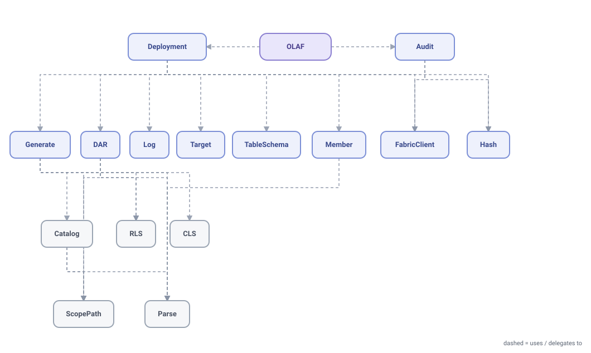
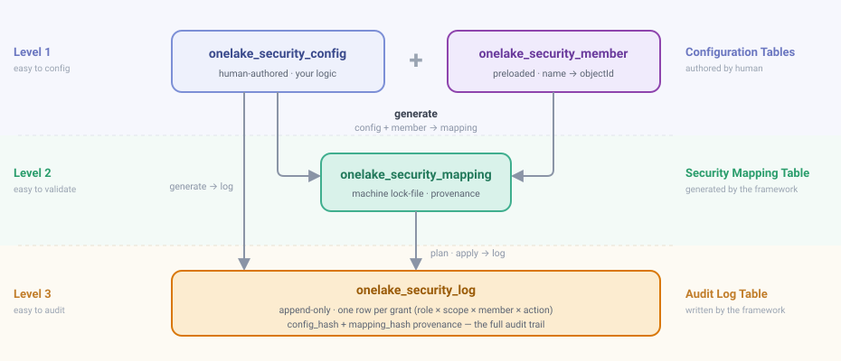

# Architecture — OneLake Access Framework

OLAF v1.1.0 is an independent community Preview for evaluation and development,
not a production-ready security product. It turns an authored role × scope × rule
matrix into reviewed Microsoft Fabric OneLake data access role (DAR) requests and
audit evidence from a Fabric notebook. Its bulk DAR mutation dependency is officially
Preview: [Microsoft REST reference](https://learn.microsoft.com/en-us/rest/api/fabric/core/onelake-data-access-security/create-or-update-data-access-roles).

OLAF is not affiliated with, endorsed by, sponsored by, or supported by Microsoft.
Deployment-specific intent belongs in the config table and runtime parameters; public
repository files contain synthetic examples only. Read the
[platform contract](platform-contract.md) and
[control-data security boundary](control-data-security.md).

---

## Class structure

The runtime is organized into **stateful** orchestration classes (`OLAF` · `Deployment` · `Audit` ·
`FabricClient` · `Log`) and **pure static-utility** classes grouped by domain (`Generate` · `DAR` ·
`RLS` · `CLS` · `Catalog` · `Member` · `Hash` · `Parse` · `ScopePath` · `TableSchema` · `Target`).
`..>` reads "uses / delegates to".

<picture>
  <source media="(prefers-color-scheme: dark)" srcset="assets/class-collaboration-dark.svg">
  
</picture>

## Shape: one self-contained runtime + optional companion notebooks

There is **one** notebook to import and invoke — no separate lib, no `%run` in the runtime path,
no notebook-level least-privilege gate.

| Notebook | Role |
|---|---|
| `olaf.ipynb` | **The runtime — everything, self-contained.** All pure functions (parse/generate/validate/diff) + the four classes (`FabricClient` · `Log` · `Deployment` · `Audit`) + the `OLAF` interactive facade + the `run_mode`/`run_and_exit` entrypoints, a `parameters` cell, and the ▶️ Run dispatch cell. `__version__` feeds provenance. Organized into markdown sections (navigable via Fabric's Outline panel). The one notebook a user/pipeline imports + invokes — every mode via the `mode` parameter. |
| `olaf_cookbook.ipynb` | **Example cookbook** (not run in CI). `%run olaf` loads `OLAF`, followed by copy-paste examples. Illustrative output is not live-release evidence. |
| `olaf_master_workflow.ipynb` | **End-to-end workflow** for setup → load → validate → generate → plan → approval → apply → verify. Sensitive stages pass the full boundary gate and record an optional isolation-attestation reference. |
| `olaf_runner.ipynb` | **Pipeline wrapper — one activity, one mode.** A `%%configure` cell binds the run's default lakehouse *by name* from a pipeline base parameter (`lakehouse_name`, the binding `olaf` deliberately does not carry), a `parameters` cell mirrors the runtime's (plus runner-only `timeout_seconds`), and a single `notebookutils.notebook.run` dispatches `olaf` — which must live in the same workspace — then exits with its result envelope for the pipeline to branch on. See [fabric-import.md](fabric-import.md#the-shipped-wrapper-olaf_runneripynb). |
| `tests/olaf_test_smoke.ipynb` | **Optional authorized live-validation scaffold.** It ships with no result and is never public CI evidence. See [live-smoke-test.md](live-smoke-test.md). Fixture-based pytest remains the automated evidence. |

The runtime is a notebook rather than a wheel/package. Fabric permissions remain
separate from OLAF mode intent: Microsoft documents that workspace **Admin or Member**
may edit DAR definitions and that the REST request requires `OneLake.ReadWrite.All`;
Contributor is not sufficient to edit DAR definitions. See
[workspace permissions](https://learn.microsoft.com/en-us/fabric/onelake/security/data-access-control-model#onelake-security-and-workspace-permissions)
and [endpoint authorization](https://learn.microsoft.com/en-us/rest/api/fabric/core/onelake-data-access-security/create-or-update-data-access-roles).

## Levels of detail: the right grain for each job

<picture>
  <source media="(prefers-color-scheme: dark)" srcset="assets/control-table-schema-dark.svg">
  
</picture>

The same security model is stored at **three levels of detail** — each grain deliberately chosen
for the one job that layer serves:

- **Level 1 · `config` + `member` — coarse, human-authored.** Which personas get what, written by
  hand. The fewest rows a person must reason about — optimized to **author and read**. *(easy to config)*
- **Level 2 · `mapping` — the resolved lock-file.** `generate` expands config into one deterministic
  row per role × scope. Frozen and machine-checkable — optimized to **validate and diff** (the exact
  desired state `plan`/`apply` compare against). *(easy to validate)*
- **Level 3 · `log` — one row per grant.** Every run appends the finest grain: role × scope × member ×
  action, stamped with `config_hash` + `mapping_hash` — optimized to **audit and trace** (prove who got
  what, when, and from which config version). *(easy to audit)*

Coarse where humans work, exhaustive where auditors do — same truth, three grains.

`onelake_security_mapping` holds one row per role × scope — the frozen lock-file that
`plan`/`apply` read. A fourth table, `onelake_security_member`, is OLAF's directory-free name→objectId
resolution source: `generate` resolves every member a config row **declares** — across all eight
member columns, include and exclude alike, and an include value its own exclude cancels — from it
and **only** it (OLAF deliberately makes no Microsoft Graph call), so it is a **required** input, preloaded
entirely from the `member` sheet of `configs/onelake_security.xlsx`. It has no FK into the others —
it feeds resolution, not the lock-file lifecycle. Full per-table, per-column reference — ER + data
dictionary: [data-model.md](data-model.md).

- **Modes:** `setup` · `generate` · `validate` (zero-write dry-run of `generate`'s validation, no
  log) · `plan` · `apply` · `rollback` (logged) — `show` (live pivot,
  read-only, no log; `by={table|role|member}` + `subject` selects the axis) — `trace` (read-only
  operational snapshot, no log; `Audit.report()` over the control tables + live DAR). The
  live mutation path is `apply`; cleanup is a separate containment utility. Every
  mode returns the unified `{mode, status, changed, message, params, data, error, batch_id, run_id,
  config_hash}` envelope (see [modes.md](modes.md#the-result-envelope)).
- **Apply:** after the saved-plan and control-data gates, OLAF writes a backup and
  durable prepared intent, then sends the Preview bulk `PUT` with the exact captured
  ETag unless conditional mutation was explicitly disabled. Microsoft's public
  contract documents the ETag/`If-Match`/`412` surface but not atomic replacement or
  deletion by omission. See [roadmap.md](roadmap.md#differential-apply--per-role-writes-instead-of-one-bulk-put)
  and [error-handling.md](error-handling.md#does-apply-land-as-one-write).
- **`batch_id`** (a fresh uuid per invocation, or the pipeline run id when one is passed)
  correlates every log row a single `plan`/`apply` invocation writes — and a pipeline that
  passes its run id to both runs can use it to tie them together. The saved-plan gate itself
  never reads it: `Log.find_plan_record` matches a plan record on `config_hash` **and**
  `mapping_hash`.
  `config_hash`/`config_version` link a log row to the exact config generation that produced
  it — the identity that survives `onelake_security_mapping` being overwritten by later generates
  (see data-model.md's provenance section).

## Control-data boundary

The four control tables and the complete `/Files/security` subtree contain sensitive
principal, policy, provenance, and recovery state. Every sensitive write requires an
immutable, ETag-bearing DAR snapshot with no reserved-path overlap, and records an
optional per-run operator workspace-isolation attestation — recorded, never enforced:
a run without one proceeds and is reported as `unknown`. A PII-free operation sentinel is
created/read before the first sensitive write, then revalidated with the captured snapshot
immediately before every sensitive write. It is cleared only by its owning successful run after a
safe post-check.

DAR snapshot safety and operator-attested workspace state are reported separately.
The DAR API/ETag cannot observe workspace sharing, elevated roles, dynamic membership
events, shortcuts, prior reads/copies, or a grant that appears and disappears between
snapshots. The same-lakehouse design is not cryptographic or transactional isolation.
See [control-data-security.md](control-data-security.md) and Microsoft's
[DAR list/ETag contract](https://learn.microsoft.com/en-us/rest/api/fabric/core/onelake-data-access-security/list-data-access-roles).

## Rule catalog

**Rule codes.** Every check carries a short code (e.g. `C5`) that appears in its error/warning
message, so you can look it up here. The **letter is a category** — what the check inspects — **not**
an abbreviation of "rule":

- **A** — per-row scope resolution (include/exclude pairing, globs, the effective set).
- **B** — per-row role & permission format (`role_name` rules, where RLS/CLS may be placed).
- **C** — cross-row / cross-role consistency + the RLS/CLS validation rules (a role's rows and members
  checked against each other, the config, and the live state).

The number is the check's stable id within its group; a few numbers are unused — the codes never
renumber, so an error's code always points back here. **B4** was vacated once — the rule that warned on a
direct user member, removed 2026-08-05 — and then reissued for the DAR Action enum check documented
below, so it is live today. Nothing is currently vacated — in particular `C15` is live, not a gap.

### A — per-row scope resolution (include/exclude, globs, effective set)

| # | Check | Level | Fix |
|---|---|---|---|
| [A1](#a1) | every row must grant **at least one** table or folder | 🔴 error | add an include — an exclude alone isn't a grant |
| [A2](#a2) | a scope pattern (table or folder glob) matches **0 targets** — include **or** exclude | 🔴 error | fix the pattern/spelling; the message names the near miss |
| [A3](#a3) | a table entry looks like a folder path (or vice versa), or doesn't match the required path form | 🔴 error | use the matching column and its path form (`schema.table` / `/Tables/schema/table` for tables, `/Files/...` for folders) |

### Pairing rules (every include/exclude column pair)

For tables, folders, and each member type, `generate` resolves the row's effective set as
**include − exclude, exclude always wins**:

| include | exclude | Verdict |
|---|---|---|
| set | blank | ✅ grant the includes |
| set | set | ✅ include − exclude |
| blank | set | ❌ error — exclude without include has nothing to subtract from |
| blank | blank | ✅ for a single scope-type pair (the row just doesn't touch that scope type) — but rule A1 fires if **every** scope include column on the row is blank; for member columns, at least one type must be declared (rule C1) |

A row whose effective set is **empty after subtraction** (exclude wiped every include) is an error
for both scopes and members — rule A1 / rule C1 respectively.

**The 0-match rule turns on whether the author could SEE the set, not on scope-vs-member.** For
tables and folders, an exclude entry matching **0 targets** is an error — the same rule A2 that
applies to an include — because a dead exclude leaves everything it was meant to remove still
granted. A **literal** member exclude is deliberately not checked that way: it is validated against
`onelake_security_member`, not against its own include column, so one that currently removes nothing
is accepted in silence. It subtracts from a list the author wrote out by hand, so declaring one that
removes nothing is a statement of intent, not a typo against a set you cannot see — and the
must-exist-in-the-member-table requirement is already doing the 0-match check's job for it.

A **member pattern** has no such backstop, so C15 errors on both directions, exactly like A2: a
member include may itself be a `glob:` pattern, and a 0-match pattern is caught on either side —
the literal exclude's silent-acceptance exemption above does not extend to it.

### B — per-row role & permission format

| # | Check | Level | Fix |
|---|---|---|---|
| [B1](#b1) | `role_name` must be alphanumeric, start with a letter, **≤124 chars** | 🔴 error | rename to fit the format |
| [B2](#b2) | `rls_condition` set on a row that grants **no tables** (RLS applies to tables only, never folders) | 🔴 error | add a table grant to the row, or drop the RLS |
| [B3](#b3) | a **ReadWrite** row carries RLS or CLS | 🔴 error | drop the RLS/CLS, or change the row's permission to Read |
| [B4](#b4) | `permission` outside the DAR **Action enum** (`Read` / `ReadWrite`, case-insensitive) | 🔴 error | use `Read` or `ReadWrite`; an empty cell defaults to `Read` |

### C — cross-row / cross-role + RLS/CLS validation

| # | Check | Level | Fix |
|---|---|---|---|
| [C1](#c1) | every row of a role lists the **same members** | 🔴 error | make the lists match, or split into separate roles |
| [C2](#c2) | `lakehouse_name` must be the **attached** lakehouse | 🔴 error | attach the notebook to it (or fix `lakehouse_name`) |
| [C3](#c3) | **one policy** (RLS + CLS) per table per role | 🔴 error | split differing rules across rows using `exclude` |
| [C4](#c4) | a member reaches one table via **several roles** | 🟡 warn | intended union? ok — else tighten the roles |
| [C5](#c5) | member in an **RLS role + a different CLS role** | 🔴 error | combine both policies into one role |
| [C6](#c6) | `role_name` over OLAF's **124-character** compatibility ceiling | 🔴 error | shorten it; consult the current SQL endpoint troubleshooting limits |
| [C7](#c7) | `rls_condition` over **1000 chars** | 🔴 error | shorten the predicate |
| [C8](#c8) | restricted role **+ an unrestricted role** on a table | 🟡 warn | union nullifies the filter — remove the open grant |
| [C9](#c9) | RLS uses an **unsupported operator** | 🔴 error | use only `= <> > >= < <= IN NOT AND OR IS NULL …` |
| [C10](#c10) | RLS predicate **too complex** (many AND/OR) | 🟡 warn | split into smaller roles |
| [C11](#c11) | RLS/CLS **column case** ≠ Delta schema | 🔴 error | write the column exactly as the schema spells it |
| [C12](#c12) | `role_name` **charset** — not alphanumeric / doesn't start with a letter | 🔴 error | rename using only letters and digits, letter-first |
| [C13](#c13) | RLS predicate **names no column** (a constant such as `1=0`); ASCII barewords only | 🔴 error | filter on a real column, or don't grant the table at all |
| [C14](#c14) | RLS compares against a **bare `TRUE`/`FALSE`** — `= true`, `IS TRUE`, `IN (TRUE)` | 🔴 error | quote it (`= 'true'`); numbers need no quotes |
| [C15](#c15) | A **member pattern matches nothing** of its own `member_type` in `onelake_security_member` | 🔴 error | fix the pattern, or add the principal to the member table |

**Notes**
- **C5 blind spot:** group membership is not expanded because OLAF deliberately does
  not call Microsoft Graph. A user granted via a group on one side and directly (or
  via another group) on the other may not be identified at generate. Do not infer the
  unobserved engine result; keep RLS + CLS in **one role per persona**. Sources: the
  [combine section](https://learn.microsoft.com/en-us/fabric/onelake/security/table-column-row-security#combine-row-level-and-column-level-security)
  and the [access-control model](https://learn.microsoft.com/en-us/fabric/onelake/security/data-access-control-model#evaluating-multiple-onelake-security-roles),
  which state the unsupported case at different widths — see
  [C5](#c5) and [roadmap.md](roadmap.md#catching-the-rls--cls-cross-grant-collision-at-generate).
- **C11:** exact schema spelling is an OLAF authoring guard. Current Microsoft
  guidance says invalid or mismatched RLS can return no rows or query errors; OLAF
  makes no fail-open platform claim. Write RLS and CLS column names exactly as the
  schema spells them. Source:
  [RLS syntax](https://learn.microsoft.com/en-us/fabric/onelake/security/row-level-security-syntax).
- **C8 vs C4:** C8 is the sharper case of C4 — it fires only when one of the reaching roles is
  genuinely unrestricted on that table (C4 warns on any multi-role reach, restricted or not).
- **C6 / B1:** the 124-character role-name ceiling is OLAF's compatibility guard,
  checked per row and per coalesced role. Treat the platform limit as volatile and
  consult the current
  [SQL endpoint troubleshooting page](https://learn.microsoft.com/en-us/fabric/onelake/security/troubleshoot-onelake-security-for-sql-analytics-endpoints).
- **C12 / B1 / C6:** C12 is the per-role *charset* counterpart to C6's per-role *length* check — the
  same pairing, split by which half of B1's format rule (alphanumeric + letter-first vs. ≤ 124 chars)
  it re-checks per role instead of per row. C12 is a distinct nuance from C6: Fabric's own "Create a
  platform rules may differ by surface, so C12 checks charset/start while C6 owns
  OLAF's compatibility length ceiling.

### Rule details

Each rule below has a stable anchor (linked from the tables above), a short explanation, and a
❌ wrong / ✅ fixed example on the shared mock catalog (table `sales.orders`, group `sg-analysts`,
user `example.user@example.invalid`). The `.invalid` domain is reserved for examples
by [RFC 6761](https://www.rfc-editor.org/rfc/rfc6761.html#section-6.4). Config columns follow [config-examples.md](config-examples.md); columns
not relevant to a rule are omitted for width (in a real config, `lakehouse_name` is required on
every row).

#### A1 — Every row must grant at least one scope  🔴

A row's includes are what it grants; an exclude only subtracts. A row that names no `include_tables`
and no `include_folders` grants nothing (deny-by-default), so it is an error.

**❌ Wrong** — the row has an exclude and members but no include, so there is nothing to grant:

| role_name | include_tables | exclude_tables | include_group_names |
|---|---|---|---|
| SalesRead | | `sales.returns` | `sg-analysts` |

**✅ Fixed** — add an include; the exclude now has something to subtract from:

| role_name | include_tables | exclude_tables | include_group_names |
|---|---|---|---|
| SalesRead | `sales.*` | `sales.returns` | `sg-analysts` |

#### A2 — A scope pattern matches zero targets  🔴

Every scope pattern must resolve to at least one table or folder in the live catalog — on the
**exclude** side as well as the include side. A 0-match is almost always a typo, so it is a hard
error either way.

The exclude side used to be a 🟡 warning, on the reasoning that pre-emptively excluding a
not-yet-created table is legitimate. But the two sides fail in **opposite directions**: a dead
include grants *less* than intended and fails closed, while a dead exclude leaves everything it was
meant to remove **still granted** — it fails open. The lenient treatment was on the dangerous side,
which inverts this framework's own deny-by-default stance.

The message names the near miss, so a refusal carries its fix — `matched 0 tables:
'saels.orders' — unknown schema 'saels' — did you mean 'sales'?` — and an unknown *schema* is
reported separately from an unknown table, since schemas are created once up front.

**❌ Wrong** — `sales.ordrs` is a typo; it matches 0 tables in the catalog:

| role_name | include_tables | include_group_names |
|---|---|---|
| SalesRead | `sales.ordrs` | `sg-analysts` |

**✅ Fixed** — the pattern resolves to a real table:

| role_name | include_tables | include_group_names |
|---|---|---|
| SalesRead | `sales.orders` | `sg-analysts` |

#### A3 — Scope entry in the wrong column or path form  🔴

Table entries use `schema.table` (or `/Tables/schema/table`); folder entries use `/Files/...`. A
folder-looking path in a tables column (or vice versa), or a path matching neither form, is an
error — put the entry in the matching column and its correct form.

**❌ Wrong** — a folder path sits in `include_tables`:

| role_name | include_tables | include_folders | include_group_names |
|---|---|---|---|
| RawRead | `/Files/raw/region_a` | | `sg-analysts` |

**✅ Fixed** — folder paths go in `include_folders`; tables use `schema.table`:

| role_name | include_tables | include_folders | include_group_names |
|---|---|---|---|
| RawRead | | `/Files/raw/region_a` | `sg-analysts` |

#### B1 — `role_name` format (alphanumeric, letter-first, ≤124)  🔴

`role_name` must be alphanumeric, start with a letter, and be at most 124 characters. Format-only —
no table needed:

- **❌ Wrong:** `role_name: 2024_sales!` — starts with a digit and contains non-alphanumeric characters.
- **✅ Fixed:** `role_name: SalesReaders` — starts with a letter, alphanumeric, within 124 characters.

#### B2 — RLS on a row that grants no tables  🔴

Row-level security filters rows of a *table*; it has no meaning on a folder grant. Setting
`rls_condition` on a row that grants only folders (or nothing) is an error — attach the RLS to a
table grant, or drop it.

**❌ Wrong** — RLS on a folder-only row:

| role_name | include_folders | include_tables | rls_condition | include_group_names |
|---|---|---|---|---|
| RawRead | `/Files/raw/region_a` | | `region = 'APAC'` | `sg-analysts` |

**✅ Fixed** — the RLS now rides on a table grant:

| role_name | include_folders | include_tables | rls_condition | include_group_names |
|---|---|---|---|---|
| RawRead | | `sales.orders` | `region = 'APAC'` | `sg-analysts` |

#### B3 — RLS/CLS on a ReadWrite row  🔴

RLS and CLS are read-path filters; they cannot be enforced on a `ReadWrite` grant. A ReadWrite row
carrying `rls_condition` (or a CLS column) is an error — drop the policy, or make the row `Read`.

**❌ Wrong** — a ReadWrite grant carries an RLS filter:

| role_name | include_tables | permission | rls_condition | include_group_names |
|---|---|---|---|---|
| SalesWrite | `sales.orders` | `ReadWrite` | `region = 'APAC'` | `sg-analysts` |

**✅ Fixed** — change the row to `Read` (or drop the RLS):

| role_name | include_tables | permission | rls_condition | include_group_names |
|---|---|---|---|---|
| SalesRead | `sales.orders` | `Read` | `region = 'APAC'` | `sg-analysts` |

#### B4 — `permission` outside the DAR Action enum  🔴

The `permission` column is the DAR Action enum: `Read` or `ReadWrite` (case-insensitive — a
differently-cased valid value is normalized to the canonical token, which is also what keeps rule
B3 case-proof). Any other value is an error at generate, naming the row and the value — it used
to pass every check, land in the mapping, and die at the Fabric API mid-apply. An empty cell
still defaults to `Read`.

**❌ Wrong** — an unsupported permission value:

| role_name | include_tables | permission | include_group_names |
|---|---|---|---|
| SalesAdmin | `sales.orders` | `Admin` | `sg-analysts` |

**✅ Fixed** — use a value the API defines:

| role_name | include_tables | permission | include_group_names |
|---|---|---|---|
| SalesWrite | `sales.orders` | `ReadWrite` | `sg-analysts` |

#### C1 — A role's rows must list the same members  🔴

A role is one member set, however many rows define its scope. If two rows of the same role declare
different members, that is an error — unify the member columns, or split into separate roles.

**❌ Wrong** — the two rows of `SalesRead` declare different members:

| role_name | include_tables | include_group_names |
|---|---|---|
| SalesRead | `sales.orders` | `sg-analysts` |
| SalesRead | `sales.leads` | `sg-analysts;sg-contractors` |

**✅ Fixed** — member columns are identical on every row of the role:

| role_name | include_tables | include_group_names |
|---|---|---|
| SalesRead | `sales.orders` | `sg-analysts` |
| SalesRead | `sales.leads` | `sg-analysts` |

#### C2 — `lakehouse_name` must be the attached lakehouse  🔴

Every active row must name the same `lakehouse_name`, and it must be the lakehouse the notebook is
attached to. A blank, mismatched, ambiguous, or not-found lakehouse is an error. (Attached lakehouse
in this example: `lh_gold`.)

**❌ Wrong** — `lakehouse_name` names a lakehouse the notebook is not attached to:

| role_name | lakehouse_name | include_tables | include_group_names |
|---|---|---|---|
| SalesRead | `lh_silver` | `sales.orders` | `sg-analysts` |

**✅ Fixed** — name the attached lakehouse:

| role_name | lakehouse_name | include_tables | include_group_names |
|---|---|---|---|
| SalesRead | `lh_gold` | `sales.orders` | `sg-analysts` |

#### C3 — One policy per table per role  🔴

Within one role a table may carry exactly one RLS+CLS policy. If two rows of a role both match the
same table with different policies, that is an error — use an `exclude` on the broad row so each
table resolves to a single policy.

**❌ Wrong** — `sales.orders` gets two different RLS policies (row 1's `sales.*` also matches it):

| role_name | include_tables | exclude_tables | rls_condition | include_group_names |
|---|---|---|---|---|
| SalesTH | `sales.*` | | `region = 'TH'` | `sg-analysts` |
| SalesTH | `sales.orders` | | `region = 'TH' AND type = 'B2B'` | `sg-analysts` |

**✅ Fixed** — row 1 excludes `sales.orders`, so each table ends up with one policy:

| role_name | include_tables | exclude_tables | rls_condition | include_group_names |
|---|---|---|---|---|
| SalesTH | `sales.*` | `sales.orders` | `region = 'TH'` | `sg-analysts` |
| SalesTH | `sales.orders` | | `region = 'TH' AND type = 'B2B'` | `sg-analysts` |

#### C4 — A member reaches a table via several roles  🟡

When one member reaches the same table through more than one role, the combined
policy may widen access. RLS/role access generally combines by union, while SQL
analytics endpoint CLS uses deny/intersection semantics. OLAF warns and requires an
engine-explicit calculation rather than publishing one engine-agnostic answer:
[multiple-role evaluation](https://learn.microsoft.com/en-us/fabric/onelake/security/data-access-control-model#evaluating-multiple-onelake-security-roles)
and [CLS semantics](https://learn.microsoft.com/en-us/fabric/onelake/security/data-access-control-model#column-level-security).

**❌ Warns** — `sg-analysts` reaches `sales.orders` through two roles:

| role_name | include_tables | include_group_names |
|---|---|---|
| SalesRead | `sales.orders` | `sg-analysts` |
| SalesExtra | `sales.orders` | `sg-analysts` |

**✅ Fixed** — a single role grants the table:

| role_name | include_tables | include_group_names |
|---|---|---|
| SalesRead | `sales.orders` | `sg-analysts` |

#### C5 — RLS role + a different CLS role for one member  🔴

A member in an **RLS** role and a **different** CLS role: OneLake cannot merge a row filter with a
column mask across roles, so that member's queries fail at runtime. Keep one policy per persona —
carry both the RLS and the CLS in a single role.

Microsoft states this at two different widths, and OLAF enforces the wider one:

| Source | What it says is unsupported |
|---|---|
| [combine section](https://learn.microsoft.com/en-us/fabric/onelake/security/table-column-row-security#combine-row-level-and-column-level-security) | "the combination of two or more roles where one contains RLS rules and another contains CLS rules" — no mention of tables or of which columns |
| [access-control model](https://learn.microsoft.com/en-us/fabric/onelake/security/data-access-control-model#evaluating-multiple-onelake-security-roles) | "the same user in two or more roles with **different allowed columns** … if any of the roles also has an RLS statement" — the worked example is one table |

The same page also describes the general model as a **UNION**: "RLS is combined across predicates
using an OR operator." So the unsupported combination is an exception carved out of a
least-restrictive model, which is why it errors rather than resolving. **C5 fires across tables and
regardless of whether the column sets differ** — stricter than either quotation requires. That is a
deliberate fail-closed choice on an untested question, not a reading of Microsoft's text; the
experiment that would settle it is in [live-smoke-test.md](live-smoke-test.md).

**❌ Wrong** — the synthetic example user is in an RLS role *and* a CLS role on `sales.orders`:

| role_name | include_tables | rls_condition | include_columns | include_user_names |
|---|---|---|---|---|
| SalesRLS | `sales.orders` | `region = 'APAC'` | | `example.user@example.invalid` |
| SalesCLS | `sales.orders` | | `order_id;amount` | `example.user@example.invalid` |

**✅ Fixed** — one role carries the row filter *and* the column allow-list:

| role_name | include_tables | rls_condition | include_columns | include_user_names |
|---|---|---|---|---|
| SalesAPAC | `sales.orders` | `region = 'APAC'` | `order_id;amount` | `example.user@example.invalid` |

#### C6 — `role_name` over 124 characters  🔴

The same 124-character compatibility ceiling as B1 is re-checked per role so
nothing slips through. Microsoft documents current SQL endpoint naming limits on a
volatile troubleshooting page; OLAF does not call the number a permanent no-workaround
contract:
[SQL endpoint troubleshooting](https://learn.microsoft.com/en-us/fabric/onelake/security/troubleshoot-onelake-security-for-sql-analytics-endpoints).

- **❌ Wrong:** `role_name` = a 130-character string (e.g. `SalesOrdersReadersForTheAsiaPacificRegion…` padded to 130 chars).
- **✅ Fixed:** `role_name: SalesAPACReaders` — comfortably within 124 characters.

#### C7 — `rls_condition` over 1000 characters  🔴

An RLS predicate longer than OLAF's 1000-character compatibility ceiling is rejected
at generate. Verify current platform syntax/limits before operation:
[RLS syntax](https://learn.microsoft.com/en-us/fabric/onelake/security/row-level-security-syntax).

- **❌ Wrong:** `rls_condition` = a 1000+ character predicate (e.g. a long `region IN ('APAC','EMEA', …)` chained with dozens of `AND`s).
- **✅ Fixed:** `rls_condition: region = 'APAC'` — well under 1000 characters.

#### C8 — A restricted role plus an unrestricted role  🟡

The sharper case of C4: one member reaches a table via a restricted role and a role
that grants the same table without that restriction. This can widen effective
access, but the exact combination is engine/policy-specific; SQL endpoint CLS is not
the same as non-SQL CLS. Remove an unintended open grant and verify per engine.

**❌ Warns** — `sg-analysts` reaches `sales.orders` via a filtered role and an unfiltered one:

| role_name | include_tables | rls_condition | include_group_names |
|---|---|---|---|
| SalesTH | `sales.orders` | `region = 'TH'` | `sg-analysts` |
| SalesAll | `sales.orders` | | `sg-analysts` |

**✅ Fixed** — drop the unrestricted grant so the filter holds:

| role_name | include_tables | rls_condition | include_group_names |
|---|---|---|---|
| SalesTH | `sales.orders` | `region = 'TH'` | `sg-analysts` |

#### C9 — Unsupported RLS operator  🔴

RLS predicates may use only the supported subset (`= <> > >= < <= IN NOT AND OR IS NULL …`). Any
other operator is a hard error. Format-only:

- **❌ Wrong:** `rls_condition: region LIKE 'AP%'` — `LIKE` is not in the supported operator set.
- **✅ Fixed:** `rls_condition: region IN ('APAC','EMEA')` — uses only supported operators.

#### C10 — RLS predicate too complex  🟡

A predicate chaining many `AND`/`OR` connectives trips a complexity heuristic — a warning to split
the role into smaller ones with simpler predicates. Not a block:

- **❌ Warns:** `rls_condition: region='APAC' AND (tier='A' OR tier='B') AND (seg='X' OR seg='Y') AND status<>'closed'` — many connectives.
- **✅ Fixed:** split into smaller roles, each with a simpler predicate such as `region = 'APAC'`.

#### C11 — Column case must match the Delta schema  🔴

RLS/CLS column names must match the Delta schema's exact spelling. This is an OLAF
authoring guard. Current Microsoft guidance says invalid/mismatched RLS can return no
rows or SQL query errors; OLAF does not claim a fail-open service behavior. Write the
column exactly as the schema spells it:
[RLS syntax](https://learn.microsoft.com/en-us/fabric/onelake/security/row-level-security-syntax).

**❌ Wrong** — the schema column is `RecordTypeId`; the predicate writes `recordtypeid`:

| role_name | include_tables | rls_condition | include_group_names |
|---|---|---|---|
| SalesRead | `sales.orders` | `recordtypeid = 'Invoice'` | `sg-analysts` |

**✅ Fixed** — spell the column exactly as the Delta schema does:

| role_name | include_tables | rls_condition | include_group_names |
|---|---|---|---|
| SalesRead | `sales.orders` | `RecordTypeId = 'Invoice'` | `sg-analysts` |

#### C12 — `role_name` charset (letter-first, alphanumeric only)  🔴

`role_name` must start with a letter and contain only letters and digits — no underscore, space, or
other special character. This is the per-*role* coalesced counterpart to B1's per-*row* charset+length
check, the same way C6 coalesces B1's length half: the SQL analytics-endpoint security sync mirrors
each role as the schema object `OLS_<role_name>`, which fails to sync when the name breaks Fabric's
own "Create a role" naming contract. Distinct from C6 — C6 is the 124-char length ceiling; C12 checks
charset/start only.

**❌ Wrong** — the role name contains an underscore, which is not permitted by the charset rule:

| role_name | include_tables | include_group_names |
|---|---|---|
| Sales_TH | `sales.orders` | `sg-analysts` |

**✅ Fixed** — alphanumeric, letter-first:

| role_name | include_tables | include_group_names |
|---|---|---|
| SalesTH | `sales.orders` | `sg-analysts` |

#### C13 — an RLS predicate must name a column  🔴

`rls_condition` must mention at least one column spelled with ASCII letters. This is
an OLAF fail-closed authoring rule: a constant condition is not accepted as a “grant
nothing” or “grant everything” shorthand. The platform authority remains Microsoft's
current [RLS syntax](https://learn.microsoft.com/en-us/fabric/onelake/security/row-level-security-syntax);
the release does not publish an exact-SHA live service result for constant predicates.

The check asks whether a bareword appears outside string literals. It deliberately
avoids interpreting keywords as columns. The contract is limited to ASCII identifiers;
non-ASCII predicate identifiers are outside OLAF v1.1.0's supported authoring surface.

**Scope of that claim — ASCII only (known limitation).** The bareword test is `[A-Za-z_]`, so
"bareword" means *ASCII* bareword. This never widens access; it can only over-reject. Any non-ASCII
identifier is already rejected by the pipeline before C13 matters — **C9** reads the non-ASCII
characters as unsupported operator symbols, for accented Latin as much as for non-Latin
(`RLS.unsupported_tokens("région = 'x'")` -> `['é']`;
a CJK column name has its own characters reported the same way). What a **fully non-Latin** identifier
(a bare CJK, Cyrillic or Greek column name, bracket-quoted or not) gets *additionally* is a wrong
message: it carries no ASCII letter, so C13 also reports *"RLS condition references no column"*
about a predicate that plainly names one. An accented-Latin identifier keeps its ASCII letters
(`région` splits to `r` + `gion`), so C13 does not misfire on it — only C9 rejects it.

The v1 rule remains intentionally narrow rather than silently changing accepted
configuration. A future Unicode expansion requires explicit tests and documentation.

**❌ Wrong** — a constant predicate, intended to grant no rows:

| role_name | include_tables | rls_condition | include_group_names |
|---|---|---|---|
| SalesTH | `sales.orders` | `1=0` | `sg-analysts` |

**✅ Fixed** — filter on a real column (to grant no rows, don't grant the table at all):

| role_name | include_tables | rls_condition | include_group_names |
|---|---|---|---|
| SalesTH | `sales.orders` | `region = 'TH'` | `sg-analysts` |

#### C14 — a bare `TRUE` / `FALSE` is not a value  🔴

OLAF v1 treats bare `TRUE`/`FALSE` in a value position as ambiguous and requires a
quoted literal. This is an OLAF compatibility guard, not a claim about every engine
or future parser. Consult Microsoft's current
[RLS syntax](https://learn.microsoft.com/en-us/fabric/onelake/security/row-level-security-syntax).

**Value position only.** These are OLAF v1 authoring outcomes:

| OLAF rejects | OLAF accepts for further validation |
|---|---|
| `Is_Current = true` | `Is_Current = 'true'` |
| `Is_Current IS TRUE` · `IS NOT FALSE` | `Is_Current IS NULL` · `IS BLANK` |
| `Is_Current IN (TRUE)` | `Lead_Source IN ('a','b')` |

A standalone `WHERE TRUE` is not classified as a value-position case. An `IN` list
checks every value slot. `RLS_VALUE_PRECEDE_RE` reads backwards from the token so the
rule remains separate from general operator/column parsing.

**Numbers are outside C14.** The rule does not try to decide which quoted/unquoted
numeric form a service/runtime will accept; use the official syntax and a supported
test environment.

**Known parser residual.** An unquoted date-like literal such as
`Birthdate = 1980-01-01` is outside C14. OLAF does not publish a service outcome for
that form; validate it against Microsoft's current syntax before use.

The release has fixture-based validation evidence only; it does not publish an
exact-release-SHA live DAR result for these examples.

#### C15 — a member pattern that matches nothing  🔴

A `*`/`?` pattern in a member column that matches no row of its own `member_type` in
`onelake_security_member` is an error naming the pattern, and the pattern is **dropped** from the
cell rather than passed along. See [Wildcard rules](#wildcard-rules) for how expansion itself works.

**Both directions error, unlike a dead literal exclusion, which is accepted.** That looks
inconsistent until you notice what the existence requirement is already doing. For a literal, "must
exist in `onelake_security_member`" *is* the 0-match check — an exclusion naming a real principal who
happens to subtract nothing is a normal defensive spelling, and is allowed. A pattern has no such
backstop, so without C15 a typo'd `sg-anaylsts-*` would silently subtract nobody. `Catalog.resolve_tables`
records the same reasoning for scopes: a dead include grants less than intended and fails **closed**,
while a dead exclude leaves everything it meant to remove still granted and fails **open** — so the
dangerous direction must not be treated more leniently than the safe one.

Dropping the pattern matters as much as the error. Errors are collected, not raised, so a pattern
left in the cell would otherwise flow on to the No-Graph member gate, which advises *"add it (with
its objectId)"* — nonsense for a glob, which is never a single principal the gate could add. The
pattern is dropped before it can reach that gate.

### CLS modes (`include_columns` / `exclude_columns`)

CLS is its own include/exclude pair, but with the opposite default from scopes — a granted table
shows *all* columns unless CLS narrows it:

| include_columns | exclude_columns | Meaning | Verdict |
|---|---|---|---|
| blank | blank | no CLS — every column visible | ✅ |
| blank | set | **blacklist** — hide these, show the rest | ✅ common case; the *config's* intent is fail-**open** (a column never named to exclude needs no edit to become visible) but the *deployed* payload is a snapshot: a column added to the table after `generate` is fail-**closed** on the live side — hidden until the next `generate` + `apply` recomputes the allow-list and auto-exposes it |
| set | blank | **whitelist** — show only these, hide the rest | ✅ fail-**closed**, permanently: a column added later stays hidden until it is explicitly added to `include_columns` — re-running `generate` alone does not expose it |
| set | set | ambiguous mode | ❌ error — pick one per row |

`generate` materializes both modes into one resolved `visible_columns` **allow-list** per (role,
table) grant, sent to the DAR as `columnNames` with `columnEffect: "Permit"`: blacklist mode
computes `all catalog columns − exclude_columns`; whitelist mode's list *is* `include_columns`
(the columns that exist on the table). **A column absent from this list is not permitted** — DAR
CLS is an allow-list, so an unlisted column defaults to hidden, which is what makes the payload
fail-closed between generations regardless of mode. A resolution that would leave **0 visible
columns** on a table is also a hard error — deny the table (omit it) instead of hiding every
column.

### Column-existence validation (new)

A wildcard include can sweep in tables that lack a column an RLS predicate or CLS list
references — that would otherwise fail at query time, not apply time. `generate` validates that
every referenced column exists in every effective table (the canonical dict carries per-table
column metadata from the Spark catalog); missing columns are a hard error listing the offending
tables.

### Wildcard rules

| Target | Rule |
|---|---|
| Tables — schema part | Literal only, no wildcards |
| Tables — table part | `*` / `?` allowed |
| Folders | `*` / `?` match within a single path segment — never across `/`; no `**` |
| Members | `*` / `?` allowed **only behind the `glob:` marker** — `glob:sg-*` — expanded from `onelake_security_member` and filtered by the column's own `member_type` (C15) |

There is deliberately no `ALL` keyword — a bare grant-everything token is ambiguous about schema
scope. "Everything except X" is written per schema (`include_tables: sales.*;hr.*` +
`exclude_tables: sales.salary_history`). Blank `include_*` stays an error (A1, deny-by-default).

**A member value is a pattern only if it says so.** Entra permits `*` and `?` in a displayName, so
sniffing for those characters cannot tell a glob from a real name — and guessing wrong grants a
**different principal with no error at all** (`Sales? Reporting` expanding against
`Salesx Reporting`). A member pattern therefore carries the `glob:` marker — `glob:sg-*` — and
anything without it is a literal name, however it is spelled. Scope globs need no marker: a Delta
table cannot be named `*`, so there is nothing to confuse them with.

**Member wildcards expand from the member table, never from Entra.** A `glob:` pattern in any of the
eight member columns is resolved against `onelake_security_member` — the No-Graph gate's only directory —
and only against rows of that column's own `member_type`, so `include_sp_names: sg-*` matches no
Group however many Groups are named `sg-…`. Matching is case-insensitive, and the expansion emits
the spelling the member table holds, so a pattern-expanded row and a literal row can never disagree
about case. Expansion happens inside the shared validation pipeline — so `validate` and `explain` see it too, not
only `generate` — and the mapping stores the expanded names: `apply`
needs real objectIds, and a pattern in the lock-file would make `plan` stop being a faithful preview.

Two consequences worth stating plainly:

- **The member table becomes an implicit grant list** for any role using a pattern. Adding a
  principal there — often for an unrelated role — joins it to every matching role, with nothing in
  the config diff to show it. `explain` renders what each pattern expanded to; read it before a deploy.
- **A row carrying a member wildcard does not take the `generate` idempotency skip.** `config_hash`
  fingerprints the config rows only, so a member added to the table leaves it unchanged; without the
  opt-out, `generate` would report no change and the newly matching principal would never be granted.
- **The same blind spot applies to a literal member row whose objectId drifts.** `config_hash` sees
  only the config's authored names, never the objectIds those names resolve to, so an Entra
  rotation or a corrected row in `onelake_security_member` is also invisible to it. `generate`
  closes this gap the same way: on every skip check it re-derives the mapping's stamped member
  objectIds against what the member table resolves those names to *today*
  (`Deployment._member_ids_drifted`) and regenerates instead of skipping when they disagree — even
  though the config itself is byte-identical. Both exceptions share one root: `config_hash` cannot
  see the member table it depends on.
- **The saved-plan gate closes the same blind spot on the deploy side.** A plan record is matched
  on `config_hash` **and** `mapping_hash`, so a mapping regenerated with different member objectIds
  (same config rows) voids an earlier plan instead of unlocking `apply` — what gets applied is
  always the exact resolution a plan displayed for review.
- **The skip also re-checks the stamped target.** `config_hash` cannot see *where* a mapping was
  generated either, so a mapping whose stamped workspace/lakehouse ids no longer name the attached
  target regenerates instead of skipping (`Deployment._target_drifted`) — the plan/apply
  `TARGET MISMATCH` remedy (re-run `generate`) therefore genuinely re-stamps.

### Limits (fail at generate/plan, not at apply)

OLAF v1.1.0 snapshots the following compatibility ceilings from Microsoft's
official limitations reviewed on 2026-08-22. They are volatile service values; check
the current source before operation:
[OneLake security limitations](https://learn.microsoft.com/en-us/fabric/onelake/security/data-access-control-model#onelake-security-limitations).

| Check | Ceiling | Severity |
|---|---|---|
| Paths per role | 500 | error at generate (warn at 80%) |
| Members per role | 500 | error at generate (warn at 80%) |
| Roles per item | 250 (the official page describes a support-assisted increase) | error at generate (warn at 80%); the payload OLAF constructs is bounded too |

Fallback playbook (shard / consolidate into groups / request quota increase):
[runbook.md §7](runbook.md).

### Provenance

`config_hash` is a content fingerprint — the staleness guard's
comparison key — computed over the active rows projected to `CONFIG_AUTHOR_COLUMNS`, so columns
another framework adds to the physical table never move it. `config_version` is the Delta commit version of `onelake_security_config` at
generate time — a monotonic, human-readable label used for `VERSION AS OF` retrieval, not the
staleness guard itself. `framework_version` is the library's `__version__`, and `generated_at`
records when generate ran. Full detail: data-model.md.

## Key invariants

1. The plan/apply role build reads **only** the mapping lock-file — never the short config (TOCTOU closed).
2. New tables are absent from the saved mapping until the next generate. The resulting platform access still depends on workspace/item permissions and engine/access mode; OLAF does not infer that nobody can read them.
3. Glob (A2): 0-match on an include OR an exclude = error; table schema part is literal-only. Case resolves through the catalog. Role and predicate limits are OLAF compatibility guards tied to the cited current platform pages, not permanent no-workaround guarantees.
4. G3 (guidance, not enforced): `NOT IN` against a nullable column drops NULL rows silently —
   SQL three-valued logic makes `NOT IN` UNKNOWN for a NULL, and `WHERE` keeps only TRUE. Guard it
   with `OR <col> IS NULL`, or assert the column is never NULL; do one of the two deliberately.
   OLAF emitted this as a per-row warning until 1.1.0 and no longer does: it fired on every
   deny-list in every run, named only one of the two valid mitigations, and the noise hid real
   warnings.
5. Cross-row rules (see the Rule catalog above) warn/block ambiguous multi-role policy shapes. Effective access is engine-explicit because SQL endpoint CLS differs from non-SQL CLS. C5 is a conservative guard around Microsoft's documented unsupported RLS/CLS combinations; it does not extrapolate untested behavior across tables or membership paths.
6. Log rows are single-valued — one row per (role × scope × member × action) step; lists never reach the log. Every log row also carries `config_hash`/`config_version`.
