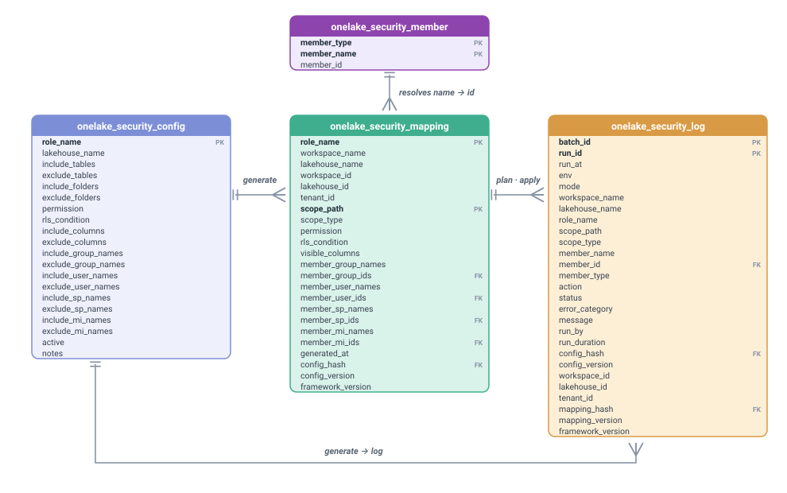

# Data model — control tables (relationships + data dictionary)

> One row of `onelake_security_mapping` is one **[grant](glossary.md#grant)** — one role granting
> one permission on one scope to one member set. That is the unit every count in this repo counts.

Four Delta tables carry OLAF control data. Names are parameters (defaults shown);
`mode=setup` creates them. Three form a **lock-file pipeline** — like `package.json` →
`package-lock.json` → a deploy log — and the fourth, `onelake_security_member`, is the **No-Graph**
name→objectId resolution table `generate` consults: it is the single source for member resolution
(no Microsoft Graph), preloaded entirely from the `member` sheet of `configs/onelake_security.xlsx`.

> **Public Preview safety boundary:** these tables contain security-sensitive identifiers and
> policy. Do not upload a real workbook or enable a mutating mode until the control store has
> passed an external-access review and the current run has an independent workspace-isolation
> attestation. See [control-data security](control-data-security.md). OLAF deliberately does not
> call Microsoft Graph; that is a framework design choice, not a platform impossibility claim.

**Keys are logical, not enforced.** Delta / the lakehouse has no primary-key or foreign-key
constraints — everything below labelled `PK`/`FK` is *modeled intent* for readers, not
something the platform checks at write time. There are also no traditional foreign keys between
these tables: the mapping-to-log link is a **generation identity** (`config_hash` +
`config_version`), not a referential-integrity constraint — see
[Provenance & generation tracing](#provenance--generation-tracing) below.

**Autotrim on read.** Every `STRING` value read from `onelake_security_config` (the active rows
`generate`/`validate` load) and from `onelake_security_member` is `.strip()`-ed of leading/trailing
whitespace at the read seam (`Parse.trim_row`), before any validation or resolution runs — so a
`role_name`, table/folder pattern, member name, or `notes` value with stray whitespace from a
copy-paste or an Excel export never trips a spurious mismatch. Only the field's own *outer*
whitespace is stripped: whitespace *inside* an `rls_condition` string literal (e.g. `Type = 'A B'`)
is untouched, because the whole field is stripped once, never its substrings. The `active` boolean
column (and any `NULL` read back as `None`) passes through unchanged.

## Table relationships

How the four control tables relate — `generate` builds `mapping` from `config`, the required `onelake_security_member` table (No-Graph) resolves member names to objectIds, and both the config side (`generate`) and the mapping side (`plan`/`apply`) append to the `log`:

<p align="center"><picture>
  <source media="(prefers-color-scheme: dark)" srcset="assets/control-table-er-dark.svg">
  
</picture></p>

> **Note:** `generate` derives the `mapping` lock-file from `config`. `onelake_security_member` is the **required** No-Graph name→objectId source consulted during `generate` — every member a config row **declares** — across all eight member columns, `include_*` and `exclude_*` alike — must be present in it (preloaded from the `member` sheet of `configs/onelake_security.xlsx`); there is no Microsoft Graph fallback. The append-only `log` is written from **both** sides: `generate` (config side, stamping `config_hash`/`config_version`) and `plan`/`apply` (mapping side, stamping `mapping_hash`/`mapping_version`). The per-column dictionary below is the authoritative reference for each column — its type, nullability, logical primary/foreign keys, defaults, and write/read ownership.

Keys are **logical** — the lakehouse enforces no primary or foreign keys; they express the intended
model for readers. The full per-column reference (default · allowed values · example · written-by /
read-by) is the data dictionary below.

**Ownership:** `onelake_security_config` = 👤 humans (edited via PR / Excel-style authoring) ·
`onelake_security_mapping` = 🤖 machine **lock-file** (written only by `generate`; never edit; the only
input `plan`/`apply` read) · `onelake_security_log` = 🤖 append-only audit trail ·
`onelake_security_member` = 👤 human-owned **resolution table** (name→objectId; preloaded entirely from
the `member` sheet of `configs/onelake_security.xlsx` — the No-Graph single source; reloaded when the file changes).

Physical note: the **Logical type** column IS the physical Delta column type. Five columns are not
`STRING` — `onelake_security_config.active` (`BOOLEAN`), `onelake_security_mapping.generated_at`
and `onelake_security_log.run_at` (`TIMESTAMP`), `config_version` on both and
`onelake_security_log.mapping_version` (`BIGINT`) — and `TableSchema.COLUMN_TYPES` in the runtime is the single source those five come
from: the `CREATE TABLE` DDL, `setup`'s `ALTER ADD COLUMNS` and its type-drift warning, and both
write paths all read that one map, so they cannot disagree.

One column is deliberately `STRING` despite looking otherwise: `run_duration` holds a rounded
float of elapsed seconds and is read as a label, never arithmetic. Changing it is a data-model
decision, not a tidy-up.

---

## onelake_security_config 👤 — the authoring sheet

Grain: **one row = one policy statement** (scope set × RLS/CLS policy). A role may span several
rows — this is how per-table RLS/CLS is expressed without splitting roles (the carve-out pattern;
see [architecture.md](architecture.md)). Every `include_*`/`exclude_*` column is a `;`-separated
list.

| Column | Logical type | Default | Allowed values | Nullable | Example stored value | Written by | Read by |
|---|---|---|---|---|---|---|---|
| `role_name` | string | — | OLAF compatibility subset: alphanumeric, letter-first, ≤ 124 chars. The bound is scoped to current SQL-endpoint guidance and may change; verify the [current Microsoft troubleshooting page](https://learn.microsoft.com/en-us/fabric/onelake/security/troubleshoot-onelake-security-for-sql-analytics-endpoints) | No (non-null, but not unique — dup detection is by full-row hash) | `SalesTH` | Human (config authoring) | `generate` |
| `lakehouse_name` | string | — | the **required** target lakehouse display name; every active row must name the same lakehouse (case-insensitive), and it must be the lakehouse the notebook is **attached** to (generate's target guard) | No — required (a blank value is a validation error) | `LH_Gold` | Human | `generate` (lakehouse target guard: resolves it case-insensitively against the attached workspace → canonical spelling stamped into the mapping; blocks on missing/ambiguous/not-found/mismatch). There is **no** `workspace_name` column — the workspace auto-resolves from the attached lakehouse |
| `include_tables` | string | — | `;`-list; `schema.table` or `/Tables/{schema}/{table}`; table part accepts `*`/`?`, schema part is literal-only | Yes — blank only if `include_folders` covers the row (rule A1: every row must grant ≥ 1 scope) | `sales.*;hr.*` | Human | `Catalog.resolve_tables` (glob/format resolution against the Spark catalog), `generate` (include − exclude set math) |
| `exclude_tables` | string | — | same formats as `include_tables` | Yes | `sales.returns` | Human | `Catalog.resolve_tables`, `generate` (subtracts from the row's include set; exclude with no include is an error) |
| `include_folders` | string | — | `;`-list; `/Files/...`, `*`/`?` per path segment, no `**` | Yes | `/Files/raw/region_*` | Human | folder listing resolver, `generate` |
| `exclude_folders` | string | — | same format as `include_folders` | Yes | `/Files/raw/region_b` | Human | folder listing resolver, `generate` (subtree-descendant warning check) |
| `permission` | string | `Read` | `Read` \| `ReadWrite` (case-insensitive input is normalized). Microsoft documents `ReadWrite` as including `Read` and not supporting RLS/CLS for that permission; see [permissions and supported items](https://learn.microsoft.com/en-us/fabric/onelake/security/data-access-control-model#permissions-and-supported-items) | No | `Read` | Human | `generate` → `DAR.to_role` |
| `rls_condition` | string | — | OLAF accepts a conservative compatibility subset of the current WHERE-style syntax and applies a 1000-character SQL-endpoint guard. This is not an exhaustive platform grammar; verify the [canonical RLS syntax](https://learn.microsoft.com/en-us/fabric/onelake/security/row-level-security-syntax) and [SQL troubleshooting](https://learn.microsoft.com/en-us/fabric/onelake/security/troubleshoot-onelake-security-for-sql-analytics-endpoints) | Yes | `Region='TH'` | Human | `generate` validation and `DAR.to_role` |
| `include_columns` | string | — | `;`-list of column names — CLS whitelist | Yes (setting both `include_columns` and `exclude_columns` on one row is an error) | `employee_id;name;department` | Human | `generate` (CLS truth-table resolution into `visible_columns`, column-existence validation, rule C11 column-case guard, rule C5 cross-role RLS×CLS guard, rule C8 most-permissive-role guard) |
| `exclude_columns` | string | — | `;`-list of column names — CLS blacklist | Yes | `salary;bank_account` | Human | `generate` (same as `include_columns`) |
| `include_group_names` | string | — | `;`-list of Entra security group **display names**; a value prefixed `glob:` (e.g. `glob:sg-*`) is a PATTERN expanded from `onelake_security_member` rows of this column's `member_type` (rule C15); anything else is a literal name | Yes — at least one member column must be non-blank per row (rule C1) | `sg-sales;sg-mgr` | Human | `generate` (rule C1 identical-across-rows check; resolved to objectIds from `onelake_security_member` (No-Graph) into the mapping's typed member columns) |
| `exclude_group_names` | string | — | same format, `glob:` patterns included | Yes | `sg-contractors` | Human | `generate` (must exist in `onelake_security_member` (No-Graph gate); subtracts by name, case-insensitive) |
| `include_user_names` | string | — | `;`-list of Entra user UPNs / emails; `glob:` patterns supported, expanded by this column's `member_type` | Yes | `example.user@example.invalid` | Human | `generate` |
| `exclude_user_names` | string | — | same format; `glob:` patterns supported, expanded by this column's `member_type` | Yes | — | Human | `generate` (must exist in `onelake_security_member` (No-Graph gate); subtracts by name, case-insensitive) |
| `include_sp_names` | string | — | `;`-list of service-principal **display names**; `glob:` patterns supported, expanded by this column's `member_type` | Yes | `svc-etl` | Human | `generate` |
| `exclude_sp_names` | string | — | same format; `glob:` patterns supported, expanded by this column's `member_type` | Yes | — | Human | `generate` (must exist in `onelake_security_member` (No-Graph gate); subtracts by name, case-insensitive) |
| `include_mi_names` | string | — | `;`-list of managed-identity **display names**; `glob:` patterns supported, expanded by this column's `member_type` | Yes | `mi-fabric-pipeline` | Human | `generate` |
| `exclude_mi_names` | string | — | same format; `glob:` patterns supported, expanded by this column's `member_type` | Yes | — | Human | `generate` (must exist in `onelake_security_member` (No-Graph gate); subtracts by name, case-insensitive) |
| `active` | boolean | — | `true` \| `false` | No | `true` | Human | `generate` (filters to `active = true` rows before any resolution runs) |
| `notes` | string | — | free text | Yes | `ticket #123` | Human | none — informational only, never read by code |

20 columns.

## onelake_security_mapping 🤖 — the lock-file

Grain is one row per role × scope, which is what makes this a true mapping table rather than a
config echo. **Overwritten in full on every `generate`** — it holds only the
latest generation; history lives in `onelake_security_log`. This is the **only** table `plan` / `apply`
/ `show` read for scope, policy, and membership.

| Column | Logical type | Default | Allowed values | Nullable | Example stored value | Written by | Read by |
|---|---|---|---|---|---|---|---|
| `role_name` | string | — | inherited from config | No — grain key (composite with `scope_path`) | `SalesTH` | `generate` (overwrites the table each run) | `plan`/`apply` (`DAR.build_desired` groups rows by role), `show by=role` |
| `workspace_name` | string | — | the **attached** workspace name | No | `WS_Analytics` | `generate` (from runtime context) | provenance / audit label |
| `lakehouse_name` | string | — | the **canonical** spelling of `config.lakehouse_name`, resolved by the target guard (equals the attached lakehouse) | No | `LH_Gold` | `generate` (target guard) | provenance / audit label |
| `workspace_id` | string | — | the **attached** Fabric workspace id | No | `a1b2…` | `generate` (from runtime context) | `plan`/`apply` target-identity guard (must equal the attached workspace id, or the run is refused); provenance / audit label |
| `lakehouse_id` | string | — | the **attached** Fabric lakehouse item id | No | `c3d4…` | `generate` (from runtime context) | `plan`/`apply` target-identity guard (must equal the attached lakehouse id, or the run is refused); provenance / audit label |
| `tenant_id` | string | — | Entra **tenant GUID** stamped into DAR member payloads | No | `00000…` | `generate` (auto-resolved from runtime context, or passed) | `DAR.to_role` member `tenantId` |
| `scope_path` | string | — | `/Tables/{schema}/{table}` or `/Files/...` | No — grain key (composite with `role_name`) | `/Tables/sales/orders` | `generate` | `plan`/`apply`, `show by=table` |
| `scope_type` | string | — | `Table` \| `Folder` | No | `Table` | `generate` (per resolved scope) | `DAR.to_role` (payload scope typing), `show by=table` |
| `permission` | string | — | `Read` \| `ReadWrite` | No | `Read` | `generate` (copied from the owning config row) | `DAR.to_role` |
| `rls_condition` | string | — | WHERE-only predicate | Yes | `Region='TH' AND Type='B2B'` | `generate` | `DAR.to_role` |
| `visible_columns` | string | — | `;`-list of column names — the resolved **allow-list**; whitelist and blacklist authoring both materialize here as the columns that ARE visible (an unlisted column is hidden by DAR) | Yes | `employee_id;name;department` | `generate` (CLS truth-table resolution) | `DAR.to_role` |
| `member_group_names` | string | — | `;`-list of resolved group **display names** | Yes | `sg-sales;sg-mgr` | `generate` (typed; identical on every row of the role) | audit/log display, `show` |
| `member_group_ids` | string | — | `;`-list of resolved group **objectIds**, aligned 1:1 with `member_group_names` | Yes | `a1b2…;c3d4…` | `generate` (resolved from `onelake_security_member`, No-Graph) | `DAR.to_role` (payload member objectIds by type) |
| `member_user_names` | string | — | `;`-list of resolved user UPNs / emails | Yes | — | `generate` | audit/log display, `show` |
| `member_user_ids` | string | — | `;`-list of resolved user **objectIds**, aligned 1:1 with `member_user_names` | Yes | — | `generate` | `DAR.to_role` |
| `member_sp_names` | string | — | `;`-list of resolved SP **display names** | Yes | `svc-etl` | `generate` | audit/log display, `show` |
| `member_sp_ids` | string | — | `;`-list of resolved SP **objectIds**, aligned 1:1 with `member_sp_names` | Yes | `e5f6…` | `generate` | `DAR.to_role` |
| `member_mi_names` | string | — | `;`-list of resolved managed-identity **display names** | Yes | `mi-fabric-pipeline` | `generate` | audit/log display, `show` |
| `member_mi_ids` | string | — | `;`-list of resolved managed-identity **objectIds**, aligned 1:1 with `member_mi_names` | Yes | `d0e1…` | `generate` | `DAR.to_role` |
| `generated_at` | timestamp | — | UTC ISO-8601 | No | `2026-07-11T12:00:00+00:00` | `generate` | audit display; sufficient proxy for "when generate ran" (replaces the dropped `catalog_snapshot_at`) |
| `config_hash` | string | — | 16-char hex — `sha256(json.dumps(rows, sort_keys=True))[:16]` over the active rows **projected to `CONFIG_AUTHOR_COLUMNS`** (foreign columns on the physical table never enter the fingerprint) | No | `284ae40f8b47a294` | `generate` | `plan`/`apply` staleness guard (content-based — a no-op config rewrite does not invalidate a pending plan); generation-trace queries |
| `config_version` | bigint | — | Delta commit version of `onelake_security_config` at generate time; `null` if the config table isn't Delta or `DESCRIBE HISTORY` is unavailable | Yes | `42` | `generate` (`SELECT max(version) FROM (DESCRIBE HISTORY onelake_security_config)`) | generation-trace queries (`VERSION AS OF`), generation timeline, `show` config_version annotation |
| `framework_version` | string | — | semver of the library (`__version__`) | No | `1.0.0` | `generate` | provenance display, compatibility checks |

23 columns. The `member_*_names` carry the human-facing effective set; the `member_*_ids` carry the
objectIds resolved from `onelake_security_member` (No-Graph; aligned 1:1) that `DAR.to_role`
builds the DAR payload from.

## onelake_security_log 🤖 — append-only audit trail

One row per **single step** (role × scope × member × action), plus run-level rows where
`role_name`/`scope_path` are null: `plan`/`apply` write a `start`/`complete` pair around
their grant rows, or a single `no_change` row instead when there is no drift / the idempotent skip
applies; `generate` writes a run-level `start`/`complete` pair (no grant rows), or a single
`no_change` row on an idempotent skip; `setup` writes one `create`/`migrate`/`rebuild` row per
control table it created, migrated, or dropped-and-recreated (schema-type drift) plus a run-level
`complete`; `rollback` writes a `rollback`/`prepared` row **before** the restore and a `rollback`/`restored` row after it succeeds, then logs the
`generate`/`plan`/`apply` chain that follows under `mode=rollback`; a failed `apply` push re-stamps
a `push`/`unknown` summary row plus one `failed` row per planned role; any unexpected exception
(`run_mode`'s catch-all) writes a `run`/`failed` row. `validate`, `show` and `trace` are read-only
and write nothing. All strings except
`run_at` (timestamp) and `config_version` / `mapping_version` (bigint) — `run_duration` stays a
string deliberately (see the physical note above).

| Column | Logical type | Default | Allowed values | Nullable | Example stored value | Written by | Read by |
|---|---|---|---|---|---|---|---|
| `batch_id` | string | — | uuid or pipeline run id | No | `b7f2e1a0...` | `plan`/`apply` (stamped once per run) | pipeline plan→apply linking (the saved-plan gate matches on `config_hash` + `mapping_hash`, **not** on `batch_id`) |
| `run_id` | string | — | notebook activity id | No | `a1c9...` | every mode that logs | debugging / traceability |
| `run_at` | timestamp | — | UTC ISO-8601 | No | `2026-07-11T12:00:03Z` | every mode that logs | audit-trail queries (first/last applied, generation timeline) |
| `env` | string | — | **optional** label matching `^[A-Za-z0-9_-]{1,64}$` (validated — e.g. `dev` \| `qa` \| `prod`); refused, not repaired, because it is read back as a SQL `WHERE` literal. Unset by default: the label exists to tell one environment's rows from another's, so a deployment that does not split its log leaves it blank | Yes — **NULL** when unset; the log reads scope on `env IS NULL`, and so must an ad-hoc query (`env = ''` matches nothing) | `prod` | every mode that logs (from parameters) | environment-scoped audit queries |
| `mode` | string | — | `setup`\|`generate`\|`plan`\|`apply`\|`rollback`\|`reset`\|`sentinel_clearance` (`reset` and `sentinel_clearance` are interactive-only facade utilities, not selectable run modes; `validate`/`show`/`trace` are read-only — never log; a `rollback` run's inner chain logs under `mode=rollback`) | No | `apply` | every mode that logs | filtering by mode and provenance queries |
| `workspace_name` | string | — | target label | No | `WS_Analytics` | every mode that logs | target-scoped audit queries |
| `lakehouse_name` | string | — | target label | No | `LH_Gold` | every mode that logs | target-scoped audit queries |
| `role_name` | string | — | role name | Yes — null on run-level rows | `SalesTH` | `plan`/`apply` (per step row) | audit-trail queries ("who has access to role X") |
| `scope_path` | string | — | table/folder path | Yes — null on run-level rows | `/Tables/sales/orders` | `plan`/`apply` | audit-trail queries ("access to table Y") |
| `scope_type` | string | — | `Table` \| `Folder` | Yes | `Table` | `plan`/`apply` | filtering |
| `member_name` | string | — | member **display name** | Yes | `sg-sales` | `plan`/`apply` | audit-trail queries (member access history) |
| `member_id` | string | — | resolved member **objectId** (the value OLAF stores) | Yes | `a1b2c3d4-…` | `plan`/`apply` | `show` audit-enrichment join key (matches live DAR objectIds) |
| `member_type` | string | — | `Group`\|`User`\|`ServicePrincipal`\|`ManagedIdentity` | Yes | `Group` | `plan`/`apply` | filtering by identity type |
| `action` | string | — | `start`\|`validate`\|`create`\|`migrate`\|`rebuild`\|`update`\|`omission_candidate`\|`no_change`\|`complete`\|`guard`\|`generate`\|`plan`\|`rollback`\|`push`\|`run`\|`sentinel_clearance` (run-level `start`/`complete`; grant-grain `validate`; role diff verbs `create`/`update`/`omit`/`no_change`, where an `omit` plan entry is logged as `omission_candidate`; setup schema ops `create` = control table created, `migrate` = missing columns added, `rebuild` = table dropped and recreated for a type drift; rejection `guard`; `generate`/`plan` = their own `no_change` skip rows; `rollback` = the pre-restore reason row; `push` = the push-failure forensic summary row; `run` = `run_mode`'s unexpected-failure catch-all row) | No | `validate` | `setup`/`generate`/`plan`/`apply`/`rollback` | provenance queries (first/last deploy recorded), gate checks |
| `status` | string | — | `success`\|`failed`\|`rejected`\|`no_change`\|`drift`\|`prepared`\|`restored`\|`submitted`\|`reviewed`\|`unknown` (`submitted` records a request attempt; `unknown` means the post-write state was not confirmed. The runtime never writes literal `error` — an unexpected exception's row is `failed`, same as any other failure.) | No | `success` | every mode that logs | failure investigation, gate checks |
| `error_category` | string | — | `http`\|`validation`\|`guard`\|`unexpected` | Yes — null on success | `guard` | failure paths only | failure triage |
| `message` | string | — | human note; JSON plan payload on `plan`/`apply` `complete` rows, including `omitted_role_candidates`, `drift_omission_candidates`, and `post_state_review_required` where applicable; reset records `request="empty_payload"`, `prior_live_role_candidates`, and `post_state_review_required` in its completion summary. Those fields are candidates and review evidence, not deletion observations. Plain-text summaries remain for `setup`/`generate` (and per-table text on `setup` `create`/`migrate` rows). | Yes | `planned` | every mode that logs | debugging, plan/apply gate content inspection |
| `run_by` | string | — | resolved identity — runtime-context `userName`, else runtime-context `userId`, else `spark current_user()`. An object id may be labelled from `onelake_security_member`; the id remains on the row | Yes | `example.user@example.invalid` · `example-runner (00000000-0000-0000-0000-000000000001)` | every mode that logs | `show` audit enrichment (`first_granted_by` / `last_granted_by`), who-deployed queries |
| `run_duration` | string | — | elapsed seconds, start → complete | Yes — `complete` rows only | `12.4` | `complete` rows only | run-performance review |
| `config_hash` | string | — | 16-char hex, matches the mapping's `config_hash` at the time of the run | Yes — null on `setup` rows (setup reads no config) | `284ae40f8b47a294` | `generate`/`plan`/`apply` (NULL on `setup`) | the saved-plan gate (`find_plan_record` matches the `plan` record on this column together with `mapping_hash`); generation-trace queries (link a log row to the exact config `VERSION AS OF`) |
| `config_version` | bigint | — | Delta version of `onelake_security_config`, or null (also null on `setup` rows) | Yes | `42` | `generate`/`plan`/`apply` (NULL on `setup`) | generation timeline (`GROUP BY config_version`) |
| `workspace_id` | string | — | resolved Fabric **workspace id** of the deployed target | Yes | `a1b2…` | every mode that logs (blank on `setup`) | target-by-id audit queries |
| `lakehouse_id` | string | — | resolved Fabric **lakehouse item id** of the deployed target | Yes | `c3d4…` | every mode that logs (blank on `setup`) | target-by-id audit queries |
| `tenant_id` | string | — | Entra **tenant GUID** of the run (blank on `setup`, which resolves no tenant) | Yes | `00000…` | every mode that logs | tenant-scoped audit queries |
| `mapping_hash` | string | — | 16-char content fingerprint of the mapping lock-file at run time | Yes | `9f8e7d6c…` | `generate`/`plan`/`apply` | the saved-plan gate (`apply` matches the `plan` record on `config_hash` **and** `mapping_hash`, binding the plan to the exact mapping generation it reviewed); mapping-generation trace (config → mapping → run) |
| `mapping_version` | bigint | — | Delta version of `onelake_security_mapping`, or null | Yes | `7` | `generate`/`plan`/`apply` | mapping-generation timeline |
| `framework_version` | string | — | semver of the framework (`__version__`) that wrote the row — the **run-time** code version (may differ from the mapping's generate-time version) | No | `1.0.0` | every mode that logs | which code version ran — completes the config → mapping → code → run provenance chain |

27 columns. `member_name` (display name) and `member_id` (resolved objectId) ride together on every
grant-grain row; `show`'s enrichment joins the live DAR (which exposes objectIds) on `member_id`.

The written-by / read-by pair on every row above is deliberate: it is what makes a **dormant
column** — one that's documented but never actually populated or consulted — impossible to hide.
Every column in this table is both written and read somewhere in the framework; nothing here is
unused scaffolding.

## onelake_security_member 👤 — the No-Graph name→objectId table

Grain: **one row = one member** — a `(member_type, member_name)` display name mapped to its
Entra `objectId`. `mode=generate` resolves every config member from this table and **only** this table
(No-Graph — there is no Microsoft Graph fallback), so it is a **required, complete** input: every
member your config references must be present with its objectId, or `generate` blocks naming the
missing member. "References" means every name a row **declares** — across all eight member columns,
`include_*` and `exclude_*` alike, and including an `include_*` value its own exclude cancels — not
only the effective set that survives the subtraction and reaches the mapping. It is **preloaded entirely from the `member` sheet of `configs/onelake_security.xlsx`** (fill the
template, then load the rows); reload it whenever the file changes. `setup` creates the table, and
`generate` tolerates an absent/empty table (it then blocks on the first missing member).

Resolution is **case-insensitive** (a config `member_name` matches regardless of case), but two names
that differ **only by case** are a **hard error** wherever they appear — in this table, across config
rows, **or within a single config cell** (`include_group_names="ONELAKE-x;OneLake-x"`) — because they
are different principals (e.g. `ONELAKE-x` dept group vs `OneLake-x` matrix group). Likewise, the same
(`member_type`, `member_name`) mapped to **two different `member_id`s** (a stale GUID left after a
rotation) is a hard error — one principal maps to one id. The **mirror** is a hard error too: one
`member_id` listed under **more than one** (`member_type`, `member_name`) — a duplicate row, or the
same objectId filed under two principal types — because an objectId is unique across principal types
in Entra, so that is one principal wearing two identities. It reads as two principals in config, and
every id→name read (`run_by`, `who_can_access`) would then resolve by row order. Ids are compared
case-insensitively for both guards (an objectId is case-insensitive hex), and the table itself cannot
enforce this — Fabric accepts `PRIMARY KEY`/`UNIQUE` only as `NOT ENFORCED` — so `generate` does.
`member_type` must be one of the four values below; any other value is a hard error. A row whose
`member_id` is blank or not a GUID is skipped (so `generate` blocks with the missing-member error
rather than deploying a wrong id).

Treat name→id rows as sensitive cached control data. Verify and refresh them through an approved
directory-management process before a deployment; do not infer freshness from a display name.

Logical PK: (`member_type`, lower(`member_name`)).

| Column | Logical type | Default | Allowed values | Nullable | Example stored value | Written by | Read by |
|---|---|---|---|---|---|---|---|
| `member_type` | string | — | `Group` \| `User` \| `ServicePrincipal` \| `ManagedIdentity` (any other value = hard error) | No — PK part | `Group` | Human (xlsx preload) | `generate` (resolution key) |
| `member_name` | string | — | the display name used in config (group displayName / user UPN-or-email / SP / managed-identity displayName). **Must not contain `*`, `?` or `;`** — the row is refused: the first two are unrepresentable because a config value carrying one is read as a literal that can never resolve, and `;` is the list separator, so one such row would re-split into several members downstream | No — PK part (matched case-insensitively; case-only collisions are a hard error) | `sg-sales` | Human (xlsx preload) | `generate` |
| `member_id` | string | — | Entra `objectId` (GUID) | No — a blank / non-GUID id is skipped | `a1b2c3d4-…` | Human (xlsx preload) | `generate` (the resolved id copied into the mapping's `member_*_ids`) |

3 columns (`source` and `resolved_at` were removed — the single source is the xlsx; there is no
per-row timestamp). This is a resolution input, not part of the lock-file: `plan`/`apply` never read
it — they consume the resolved `member_*_ids` already baked into `onelake_security_mapping`.

---

## Provenance & generation tracing

There are **no enforced foreign keys** between these tables — Delta doesn't support them, and the
mapping-to-log relationship is a pipeline, not referential integrity (the mapping is overwritten
each `generate`; the log is append-only and outlives it). Two keys carry the same **generation
identity** across both:

- **`config_hash`** — a content fingerprint of the active config rows, covering
  **`CONFIG_AUTHOR_COLUMNS` only** — the columns OLAF declares. Same content → same hash; any edit
  → a new hash. This is the staleness guard's comparison key, so a no-op rewrite of the config
  (same content, new Delta commit) does not invalidate a pending plan. A control table may carry
  columns another framework added (load provenance, for example); they are outside OLAF's contract
  and do not move the hash — so a source-workbook reload that rewrites only those columns does not
  fire a needless STALE, and the same logical config hashes identically across environments. A
  *missing* declared column is refused, never silently projected past; a column OLAF itself
  declares in a future release joins the constant and therefore the fingerprint.
- **`config_version`** — the Delta commit version of `onelake_security_config` captured at generate
  time. Monotonic and human-readable; used for **retrieval** via `VERSION AS OF`. `config_hash` is
  still the authoritative staleness guard, not the version number.

### Audit query recipes

**1. Generation trace — which config produced a member's access to a table?**

```sql
-- find the generation that deployed it (grant-grain 'validate' rows carry the member × scope)
SELECT config_version, config_hash, run_at, run_by
FROM onelake_security_log
WHERE member_name = 'sg-sales' AND scope_path = '/Tables/sales/orders'
  AND action = 'validate' AND status = 'success'
ORDER BY run_at DESC LIMIT 1;

-- time-travel to the exact config that produced it — no dangling reference even though
-- onelake_security_mapping has since been overwritten by later generates
SELECT * FROM onelake_security_config VERSION AS OF <config_version>;
```

**2. Generation timeline — every config generation that has ever run (no separate ledger table)**

```sql
SELECT config_version, config_hash, MIN(run_at) AS first_seen, MAX(run_at) AS last_seen
FROM onelake_security_log
GROUP BY config_version, config_hash
ORDER BY config_version;
```

**3. Who authored the rule (not who deployed it) — the config table's own Delta history**

```sql
DESCRIBE HISTORY onelake_security_config;
-- match `version` to the config_version from recipe 1 or 2 to get the userName who committed it
```

This answers a different question from `run_by` on the log: `run_by` is who **ran** `generate` /
`apply` (deployed the change); the config table's own commit history is who **wrote** the rule.

**4. First and last deploy (apply) recorded for a live role × scope × member, and who pushed each**

The `member_id IS NOT NULL` guard selects the grant-grain deploy rows (run-level `start`/`complete`
rows carry no member); `mode IN ('apply', 'rollback')` keeps the deploying runs and drops read-only `plan` runs — a rollback chain's apply stamps its rows `mode=rollback`. `MIN(run_at)` is the establishing
deploy. The grain is
`member_id` — the resolved objectId, which is what the live DAR exposes and what `show`'s enrichment
(`grant_provenance`) joins on — with the display name riding along, so a hand-query and `show` agree
(including on which end each field comes from: `max_by` for current-state fields, `min_by` only for
the `first_*` pair):

```sql
SELECT role_name, scope_path, member_id,
       max_by(member_name, run_at)    AS member_name,
       MIN(run_at)                    AS first_applied,
       min_by(run_by, run_at)         AS first_granted_by,
       MAX(run_at)                    AS last_applied,
       max_by(run_by, run_at)         AS last_granted_by,
       max_by(config_version, run_at) AS config_version
FROM onelake_security_log
WHERE mode IN ('apply', 'replace', 'rollback')  -- deploy runs only; plan is read-only ('rollback' stamps its whole inner chain; 'replace' is retired pre-release history that still exists in this append-only table)
  AND status = 'success'
  AND member_id IS NOT NULL            -- grant-grain rows only (run-level rows carry no member)
  AND role_name = 'SalesTH' AND scope_path = '/Tables/sales/orders'
GROUP BY role_name, scope_path, member_id;
```

**Both ends are deploy timestamps; neither is a continuous-access proof.** The framework writes no
per-grant revoke rows, and it cannot see a role deleted straight from the Fabric UI. So one apply, an
out-of-band deletion and a later re-apply are indistinguishable in this table from one unbroken
grant. That is exactly why there is no single `since` column: reporting only the earliest deploy
would assert a continuity across the gap that nothing observed, and reporting only the latest would
reset on every routine re-deploy of an unchanged config — which is the very question an access review
is asking. Each END is exactly knowable, so both ship. Read them as "first deployed on" and "last
re-asserted on"; a wide gap between them is a cue to check the live DAR, not evidence either way.

Each `*_granted_by` is `run_by` copied verbatim, so it carries the same shape: a UPN for an
interactive run, and `name (objectId)` — or the bare object id when unlabelled — for a pipeline run.
Match on the parenthesised object id, not on the name: the id is what the runtime attests, the name
is an operator-supplied label from `onelake_security_member`. The actor is reported at both ends
because they are routinely different principals — a service principal deploying the first time, a
human re-running later — and a lone `granted_by` beside two timestamps would leave the reader
guessing which end it answered for. `config_version` and `member_name` follow the LATEST push, since
they describe the grant as it stands now.

`show by=role|table|member` runs the equivalent of recipe 4 automatically: the enrichment fields
(`first_applied`, `first_granted_by`, `last_applied`, `last_granted_by`, `config_version`) are read
from the log and surfaced on each entry of
`show`'s `grants` list (see [modes.md](modes.md#show--read-only-live-pivot) for the full result
shape). Each grant also carries a `provenance` field — `"framework"`, or the string
`"out-of-band — no framework provenance"` when the live grant has no matching log row (made
outside the framework, e.g. edited directly in the Fabric UI); the result's top-level
`out_of_band` key counts those. The framework log is authoritative only for framework-made changes
— attributing a UI-made edit (who/when) still requires Fabric's own activity log / Purview; `show`
surfaces the gap but cannot fill it. Full discussion:
[runbook.md](runbook.md#8-audit-trail--out-of-band-grants).
